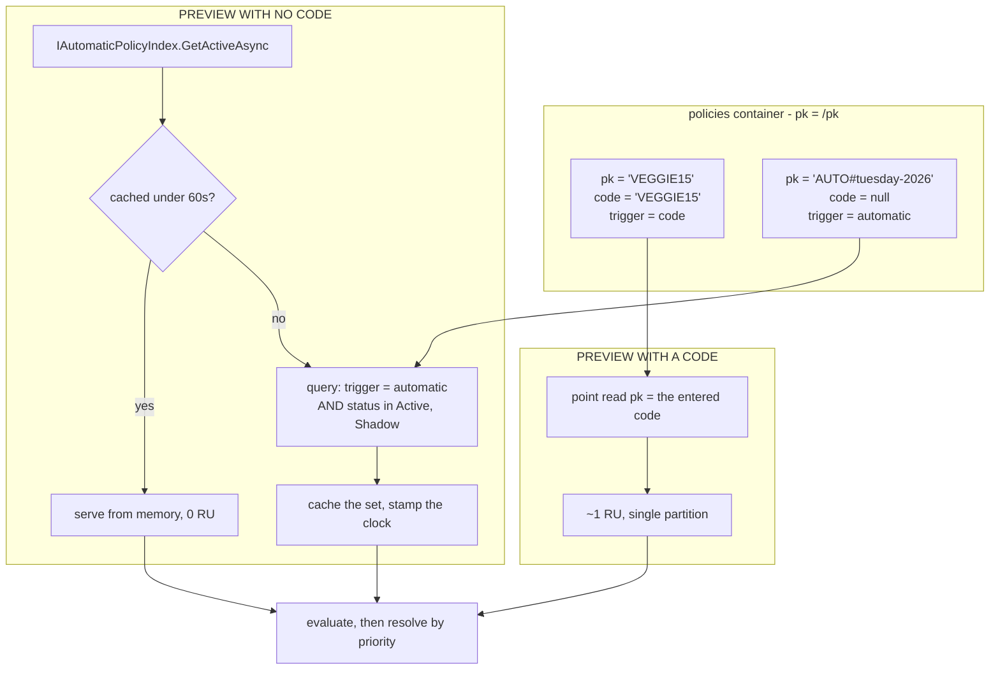
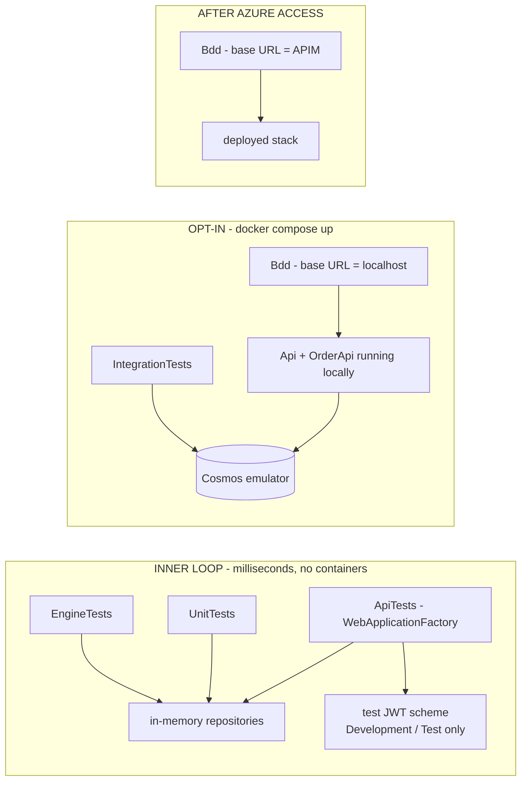

# Design: Coupon Service

## Overview

The full architecture is already written and reviewed: **[docs/solution-architecture.md](../../../docs/solution-architecture.md) is the design of record** — component structure, the policy engine, redemption lifecycle, data model, security, scalability, infrastructure, pipeline and ADRs all live there. This document does not restate it. It records the **twelve decisions taken during implementation planning** that either refine, correct or contradict it, plus the concrete type signatures and project layout so implementation is unambiguous.

---

## Decisions taken in planning

| # | Decision | Why | Effect on the design of record |
|---|---|---|---|
| P-1 | Deliver phases 0–4 locally to depth; author infrastructure and pipeline but leave them unrun until Azure access arrives | Deadline is 2–3 days and hard; the subscription has not been provided | Section 24 waves stand, but waves 4–6 are code-complete rather than proven |
| P-2 | Implement the **entire** effect grammar, including `cheapestFree`, `nthItem` and `tiered` | Each is one handler behind `IEffectHandler` and costs 40–60 lines once the compiler exists; deferring them saves little and weakens the central claim | Removes the phasing escape hatch in the risk register |
| P-3 | Partition key becomes an explicit `/pk` field rather than `/code` | Automatic policies have no code; overloading `/code` with a sentinel is confusing and blocks a null-safe schema | Section 11 said `pk = /code`. Now `pk = /pk`, where `pk` = `code` for coded policies and `AUTO#{policyId}` for automatic ones |
| P-4 | Automatic policies are discovered through a cached index, refreshed by a filtered query with a 60-second TTL | There is no key to point-read by when the customer supplies no code | New component, `IAutomaticPolicyIndex`. Consequence: activating an automatic promotion takes effect within a minute |
| P-5 | Keep asynchronous fact resolution: `ValueTask<Value>` resolvers and async compiled delegates | Chosen over a synchronous snapshot so that any future remote fact drops in without reshaping the compiler | Confirms section 5.7 as written |
| P-6 | Compile to **closures over delegates**, not `System.Linq.Expressions` | Closures are simple, allocation-light after compilation, and safe under trimming and ReadyToRun; `Expression.Compile` adds startup cost and AOT friction for no measurable gain at this tree size | Clarifies "compile to delegates" in ADR 6 |
| P-7 | Full node-by-node trace only when explicitly requested; near-miss capture always on | A full trace on every preview allocates for output nobody reads; the shortfall is a single struct and is the part customers see | Refines AC-3.7 and section 5.9 |
| P-8 | Test tokens are issued by a symmetric dev key registered **only** in `Development` and `Test`, with a startup guard that throws if enabled elsewhere; the deployed suite moves to client credentials once a tenant exists | No Entra tenant is available yet, and the assignment grades the authentication approach — the guard is the reviewable artifact that stops this becoming a bypass | Adds a constraint absent from section 12 |
| P-9 | Cosmos emulator is a dependency of a **separate integration test project** only; unit, engine and pricing tests use in-memory repositories | Keeps the inner loop in milliseconds and satisfies AC-10.5 | Refines section 19 stage 1 |
| P-10 | The Order API persists to a third Cosmos container, `orders`, partitioned by `/orderId` | In-memory orders disappear when a scale-to-zero replica recycles, which reads as a bug in a demo | Section 11 showed two containers; there are three |
| P-11 | Container Apps are provisioned with a public placeholder image, then the pipeline updates the revision with the built image | Resolves the registry chicken-and-egg on a first deploy into an empty resource group | Makes the section 18 stage order workable |
| P-12 | **Correction:** drop the APIM response-cache optimisation | The Consumption tier has no internal cache; `cache-lookup` there requires an external Redis we do not provision | Section 14 of the design of record must be edited; rely on Static Web Apps CDN plus backend `ETag` and `Cache-Control` |

---

## Project structure

```text
BSS_Project.sln
src/
  CouponService.Domain/          # Cart, Money, PriceBreakdown, DiscountPlan, Policy AST records
  CouponService.Engine/          # Parser, budget, validator, manifest, compiler, fact registry, effects
  CouponService.Application/     # ICouponValidator, IPriceCalculator, ICouponRedeemer, ports
  CouponService.Infrastructure/  # Cosmos repositories, in-memory repositories, Serilog, options
  CouponService.Api/             # Controllers, auth, middleware, DI, OpenAPI
  OrderApi/                      # Thin authoritative checkout stand-in
  web/                           # React SPA (only if phases 0-6 complete)
tests/
  CouponService.EngineTests/     # Grammar, compiler, evaluator, effects, property-based
  CouponService.UnitTests/       # Application services against fakes
  CouponService.ApiTests/        # WebApplicationFactory contract tests
  CouponService.IntegrationTests/# Cosmos emulator only
  CouponService.Bdd/             # Reqnroll, configurable base URL
infra/bicep/                     # Delivery IaC
infra/terraform/                 # Documented alternative, not wired to CI
data/                            # pizzas.json, policies.seed.json
azure-pipelines.yml
```

`CouponService.Engine` references only `CouponService.Domain`. It has no Azure, ASP.NET or Cosmos dependency — that is what makes AC-10.5 achievable and is enforced by a project-reference test.

---

## Core type signatures

```csharp
// ---- Values ----------------------------------------------------------------
public enum ValueKind { Number, Text, Bool, List }

public readonly record struct Value(ValueKind Kind, decimal Number, string? Text,
                                    bool Bool, ImmutableArray<Value> List);

// ---- Expression AST --------------------------------------------------------
public abstract record Expr;
public sealed record ConstExpr(Value Value)                                  : Expr;
public sealed record FactExpr(string Path)                                   : Expr;
public sealed record LogicalExpr(LogicalOp Op, ImmutableArray<Expr> Operands): Expr;
public sealed record CompareExpr(CompareOp Op, Expr Left, Expr Right)         : Expr;
public sealed record MembershipExpr(MembershipOp Op, Expr Subject, ImmutableArray<Expr> Set) : Expr;
public sealed record QuantifierExpr(QuantifierOp Op, string Over, Expr Where) : Expr;
public sealed record AggregateExpr(AggregateOp Op, Selector Over)             : Expr;
public sealed record ArithmeticExpr(ArithmeticOp Op, ImmutableArray<Expr> Operands) : Expr;

// ---- Compilation -----------------------------------------------------------
public enum FactCost { Pure = 0, Cached = 1, RemoteRead = 2 }

public delegate ValueTask<Value> Compiled(EvalScope scope, CancellationToken ct);

public sealed record FactDescriptor(
    string Path, ValueKind Kind, FactCost Cost,
    Func<EvalScope, CancellationToken, ValueTask<Value>> Resolve);

// ---- Effects ---------------------------------------------------------------
public interface IEffectHandler
{
    string Operator { get; }                                  // "percentage", "cap", "bestOf", ...
    DiscountPlan Apply(JsonElement node, EffectScope scope);
}

public sealed record LineAllocation(string LineId, decimal Amount);
public sealed record DiscountPlan(decimal Total, ImmutableArray<LineAllocation> Allocations);
```

`Compiled` returning `ValueTask<Value>` is the consequence of decision P-5. `EvalScope` owns the memoisation dictionary (AC-3.3), the injected clock, the fact resolution context and the trace collector, and is created per evaluation.

---

## Automatic policy storage and discovery

The one genuinely new piece of design, arising from P-3 and P-4.



Usage counters for an automatic policy live in the redemptions container under the same `pk` value, `AUTO#{policyId}`, so a capped automatic promotion uses exactly the same transactional batch as a coded one.

## Cosmos containers

| Container | Partition key | Contents | Notes |
|---|---|---|---|
| `policies` | `/pk` | Policy documents | `pk` = code, or `AUTO#{policyId}` |
| `redemptions` | `/pk` | One `counter` document plus one document per redemption | Unique key on `/orderId`; TTL enabled for `Reserved` |
| `orders` | `/orderId` | Orders written by the Order API | Decision P-10 |

One database, `coupons`. Reserve performs a transactional batch within a single `pk`: insert the redemption and update the counter with an ETag precondition.

## Local development topology



The BDD project takes its base URL and token strategy from configuration, so the same feature files run locally today and through APIM later. That is what makes AC-10.1 satisfiable inside three days without a subscription.

---

## Error handling

Beyond the contract already in section 10.1 of the design of record:

| Scenario | Response |
|---|---|
| Policy JSON has an object with more than one key | `PolicySyntaxException` → 400, node path reported |
| Unknown operator or fact path | `PolicyValidationException` → 400, listing every offending node, not just the first |
| Node or depth budget exceeded | `PolicyBudgetException` → 400, budget stated in the response |
| `engineSchema` unsupported | 422 on write; on read, the policy is skipped and an error event is logged rather than failing the whole preview |
| Fact resolver throws | Evaluation aborts, decision is `Rejected` with reason `EngineError`, 500 logged with correlation id, discount never applied |
| ETag mismatch on counter | Retry three times with jittered backoff, then 409 |
| Emulator unavailable in integration tests | Test project skips with an explicit message rather than failing the suite |

## Testing strategy

- **Unit** — application services against fake repositories and a frozen clock.
- **Engine** — parser accepts and rejects the documented grammar; compiler orders operands by cost; operator truth tables; effect arithmetic including cap rescaling and `bestOf` selection; near-miss shortfall values.
- **Property-based** (FsCheck) — for any generated basket and policy, discount is never negative, never exceeds the eligible base, and allocations always sum to the discount total.
- **Instrumented** — a counting fact provider registered for `coupon.uses.total` asserts zero invocations when a cheap predicate fails, proving AC-3.2 rather than asserting it.
- **Contract** — `WebApplicationFactory` covering 200 with rejection, 400 shapes, 401 and 403.
- **Integration** — Cosmos emulator: transactional batch, ETag conflict, unique-key violation, TTL field presence.
- **BDD** — Reqnroll, run-scoped policy prefix, seeded and torn down per run.

## Security considerations

- The test token scheme is registered behind an environment check **and** a startup guard that throws when the hosting environment is not `Development` or `Test`. A test asserts that guard fires.
- No secret in configuration files; local secrets via `dotnet user-secrets`, deployed secrets via Key Vault and managed identity.
- Mutation endpoints require the `Coupon.Redeem` role in application code, so the control holds even before internal ingress exists.
- Policy documents are data, never code. The absence of any evaluation, scripting or regular-expression facility is a deliberate, testable property.

## Open Questions

- [ ] Confirm currency `EUR`.
- [ ] Whether `simulate` moves into the three-day window if something else slips out.
- [ ] Whether the reviewer expects a green pipeline run, or accepts reviewed pipeline and Bicep source with the deployment performed once access is granted.
