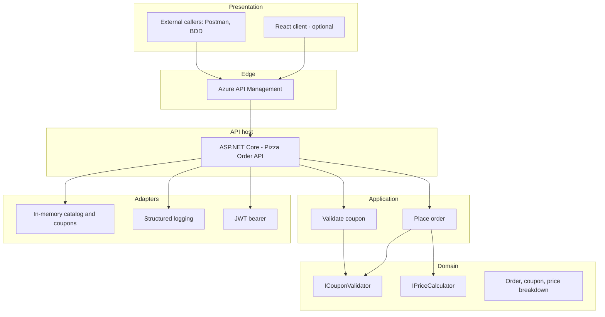
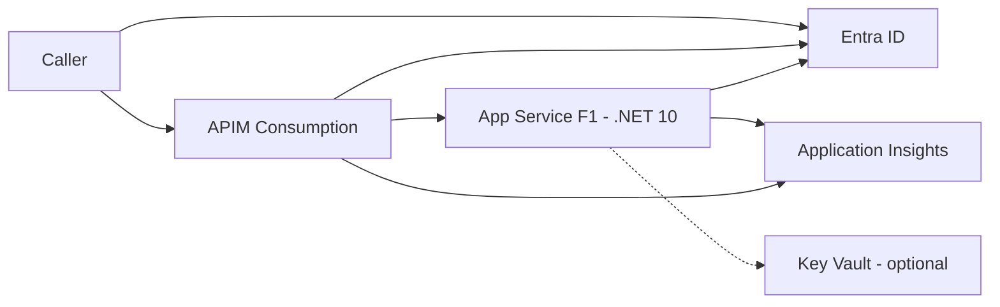
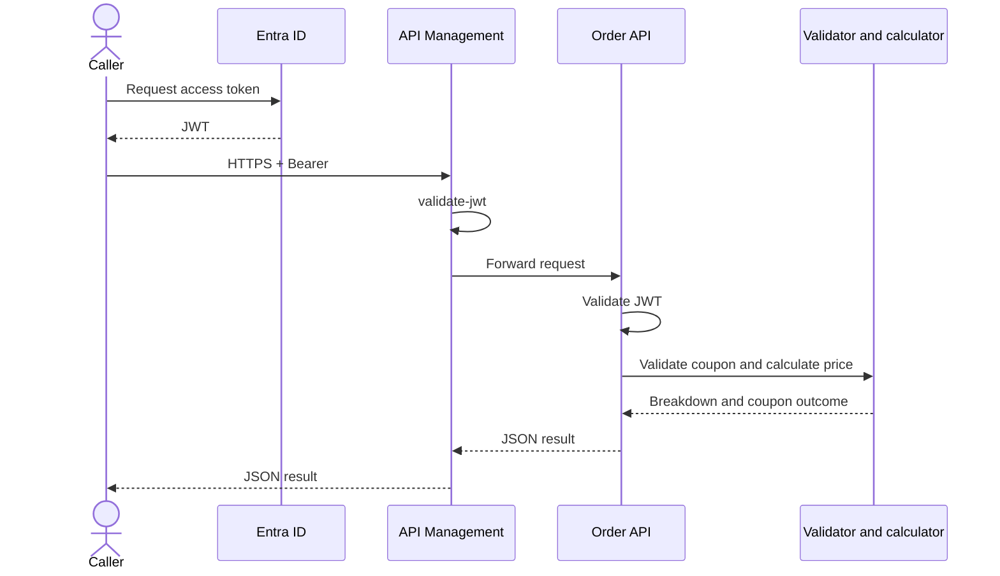
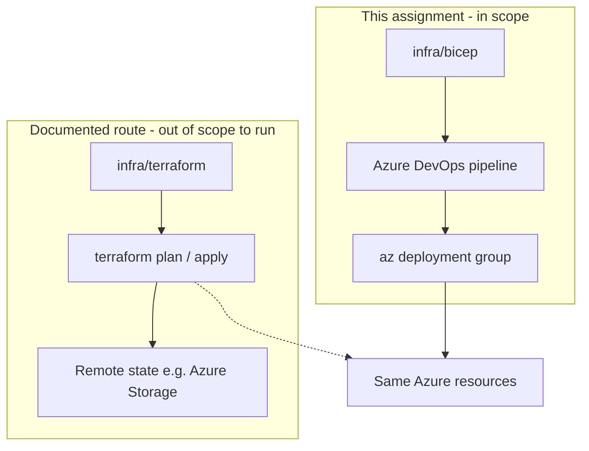

# Pizza ordering with coupons

> **Superseded.** This was the first-draft summary. The current proposal is
> [solution-architecture.md](solution-architecture.md), with the reasoning for the
> changes in [gap-analysis.md](gap-analysis.md). Notably, the design has since moved to a
> **standalone Coupon Service** with a rule engine, Cosmos DB persistence and a
> reserve/confirm/release redemption lifecycle; the in-memory, single-service model below
> is no longer what we are proposing.

## Purpose

There is **no existing pizza ordering service** in this repository or in our Azure environment. The assignment describes a platform that today takes pizza orders without coupons; **we implement that ordering service ourselves**, with coupon support included from the start.

The result is a greenfield backend: catalog, place order, coupon validation, and **price calculation that applies a coupon when it is valid**. APIs are authenticated, published through Azure API Management, deployed to Azure by pipeline, covered by BDD tests, and observable with structured logs.

This document is the agreed architecture for reviewers and collaborators.

**Runtime:** .NET 10 (current LTS).  
**Infrastructure for this assignment:** **Bicep**.  
**Terraform:** documented as an equivalent route; not used for delivery here.

---

## In scope

- A new pizza ordering API (seeded catalog, place order, order total).
- Coupon validation and order price calculation (percentage and fixed-amount coupons) as part of that same service.
- Domain interfaces that isolate pricing from HTTP and Azure.
- ASP.NET Core API secured with Microsoft Entra ID (JWT).
- APIs published through **Azure API Management**.
- Azure DevOps Git repository and a **YAML pipeline** that deploys the solution to Azure from scratch (after a one-time service connection).
- **Bicep** modules for a **minimal-cost demo** environment.
- BDD test project covering coupon validation and order pricing.
- Structured logging to Application Insights.
- Documentation: architecture, deployment, authentication, assumptions.
- React frontend **if time allows** after backend, tests, and pipeline are complete.

## Out of scope

- Integrating with, wrapping, or migrating a **pre-existing** order, POS, or website (none is available to us).
- Payment capture, invoicing, or fiscal/tax engines (unless a single tax rate is later requested).
- A separate coupon microservice or third-party coupon vendor integration.
- Azure SQL / Cosmos / Redis (catalog is a **repo seed** from Fun API, loaded in-process; no live call to the mock).
- High availability, multi-region, VNet, Private Link, WAF, Front Door.
- Paid API Management SKUs (Developer, Basic, Standard, Premium, v2 dedicated).
- Paid App Service plans and Always On (demo uses the **Free F1** plan).
- Kubernetes, containers-as-the-primary-host, Service Bus, Functions-only design.
- **Terraform state backends, Terraform Cloud, and a Terraform pipeline** for this assignment (see [Infrastructure](#infrastructure-bicep-for-this-assignment-terraform-as-a-route)).
- Production-grade identity (customer B2C, MFA policies, step-up). Entra app registrations for API + demo client are enough.
- Admin UI to create coupons, inventory, or kitchen workflows.
- Real-time order tracking, notifications, or analytics product.
- Manual Azure Portal configuration as the deployment method.

---

## Layers



| Layer | Responsibility |
|---|---|
| Domain | Coupon rules and price math. No Azure, no HTTP. |
| Application | Use cases: validate coupon, place order. |
| API | REST, authentication, logging, health. |
| Edge | APIM: public URL, JWT validation, routing to App Service. |
| Adapters | Seeded data, Application Insights, Entra JWT. |
| Infra | Bicep + pipeline. |

Price calculation is never implemented in the frontend or in APIM policies.

---

## Runtime architecture



**Request flow**



---

## APIs

| Method | Path | Purpose |
|---|---|---|
| GET | `/health` | Liveness (anonymous). |
| GET | `/pizzas` | Seeded catalog. |
| POST | `/coupons/validate` | Preview discount without placing an order. |
| POST | `/orders` | Place order; optional `couponCode`; returns line items, subtotal, discount, total, coupon outcome. |

Invalid coupons: **order is accepted**, discount is **zero**, response includes **status and reason** (assumption unless product asks to reject the order).

---

## Authentication

- Microsoft Entra ID issues JWTs.
- APIM validates the token (`validate-jwt`).
- The API validates the same token (defense in depth).
- Demo automation: **client credentials** against the API app.
- React (if built): **authorization code + PKCE**; no secrets in the browser.

---

## Testing

Dedicated **BDD** project (Reqnroll or SpecFlow).

**In scope for tests**

- Valid percentage coupon reduces total correctly.
- Valid fixed-amount coupon; total never below zero.
- Unknown, expired, or minimum-order-not-met codes: no discount, explicit reason.
- Coupon restricted to specific pizzas.
- Invalid order payload → 400.
- Missing token → 401.

**Out of scope for tests**

- Full UI E2E in the first delivery.
- Load, chaos, or penetration testing.
- Mandatory live-Azure tests in the default CI job (in-process API tests are the gate; an optional pipeline smoke against APIM may be added).

---

## Logging and monitoring

**In scope:** structured logs (order identifier, coupon outcome, totals, correlation id) in Application Insights; exception traces; APIM diagnostics at a low volume.

**Out of scope:** logging tokens, secrets, or unnecessary personal data; a full Azure Monitor workbook pack.

---

## Infrastructure: Bicep for this assignment, Terraform as a route

The author has **production experience with Terraform**. For **this assignment the delivery IaC is Bicep**: it is native to Azure and Azure DevOps, needs no remote state store, and matches “deploy the entire solution to Azure from scratch” with a single `az deployment` from the pipeline.

Terraform remains a **valid equivalent route**. The same resource graph can be expressed in `azurerm`. We are **not** maintaining two live stacks.



| Topic | Bicep (chosen) | Terraform (route not executed here) |
|---|---|---|
| Language | ARM-native DSL | HCL, `azurerm` provider |
| State | Azure deployment history | State file / backend (Storage, Terraform Cloud) |
| Pipeline | `AzureCLI@2` / `AzureResourceManagerTemplateDeployment@3` | `terraform plan` / `apply` with backend and lock |
| Auth to Azure | Service connection / OIDC | Same principal; provider `features {}` |
| What we deploy | Identical SKUs below | Identical SKUs below |

Folder intent:

```text
infra/
  bicep/          # source of truth for the assignment
  terraform/      # optional mirror / future port; not wired to CI
```

---

## Demo resources (minimal or zero cost)

One resource group in a single region that supports API Management **Consumption**.

| Resource | SKU / mode | Role |
|---|---|---|
| App Service plan + Web App | **F1** (Free), Linux, .NET 10 | Hosts the API |
| API Management | **Consumption** | Public API gateway |
| Log Analytics + Application Insights | Workspace-based, short retention, daily cap | Logs and traces |
| Key Vault | Standard, optional | Secrets if the subscription allows |
| Entra ID app registrations | Free | JWT issuer |

These SKUs are intended to stay at **zero or near-zero** for a demo (Consumption free call grant; F1 is $0). The environment is not sized for production traffic. The App Service hostname is not the public contract; **APIM is**.

**Not deployed for the demo:** Azure SQL, Redis, APIM Developer (paid), Basic/Standard App Service, AKS.

---

## Frontend (timeboxed)

**In scope if time allows:** React app to select pizzas, enter a coupon, submit the order, and display the **server-calculated** total.

**Out of scope otherwise:** design system, SEO, PWA, native apps. Pricing is not duplicated in the UI.

---

## Delivery sequence

1. Domain + BDD.
2. API + Entra JWT.
3. Bicep (F1 + Consumption APIM + Insights).
4. Azure DevOps pipeline.
5. APIM OpenAPI and JWT policy.
6. Docs (this file plus deploy and auth notes).
7. React if time allows.

---

## Assumptions

- Greenfield: we own the order API; there is no legacy service to call.
- Pizza catalog: one-time snapshot of [Fun API `GET /pizza/v1/menu`](https://funapi.dev/api/pizza/v1/menu), stored as `data/pizzas.json`. Runtime does not depend on Fun API.
- Coupons are our own seed; no external coupon service.
- No payment provider.
- No tax line unless specified later.
- Soft coupon failure (order without discount).
- Reviewers call APIM with a JWT from the provided Entra app.
- One Azure DevOps project and one Azure subscription provided by the assignment owner.

---

## What we need from the assignment owner

- Azure DevOps project access.
- Azure subscription (Contributor on a resource group or subscription) and a pipeline service connection.
- Permission to create Entra app registrations (or apps created for us).
- Preferred Azure region.
- Confirmation of coupon failure behaviour if different from the assumption above.
