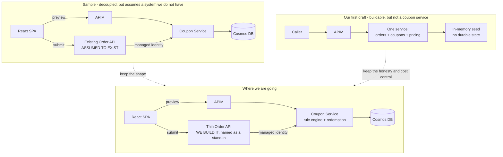

# Gap analysis: recruiter sample proposal vs our proposal

Source compared: `Coupon_Service_Proposal.pdf` ("Standalone Coupon Service Integration", 10 pages) against `docs/architecture.md` (our first draft).

The sample is a **reference of the depth expected**, not a specification we must copy. Sections 3, 5 and 10 of the PDF carry almost no extractable text, so those pages are almost certainly **diagram images** (system architecture, the reserve/confirm/release state machine, and the pipeline). That alone tells us the expected proposal is **diagram-led**.

Conclusion up front: the sample is **stronger on domain depth** (rule engine, redemption lifecycle, persistence, service-to-service trust, admin surface). Ours is **stronger on cost discipline, explicit scope boundaries and buildability**. The winning proposal takes the sample's depth and fixes the correctness and operability holes it leaves open.

---

## 1. Side by side

| Dimension | Recruiter sample | Our first draft | Verdict |
|---|---|---|---|
| Shape of solution | **Standalone** Coupon Service; existing Order API calls it | Single service that owns ordering **and** coupons | Sample matches the brief wording "new coupon service" |
| Validation model | **Double validation**: debounced preview from SPA, authoritative re-price at checkout | One validate endpoint plus pricing inside order | Sample; anti-tampering is the security story |
| Coupon rules | **Composite Specification** pattern, JSON rule trees compiled at runtime, AND/OR nesting | **Policy engine**: expression AST over a typed fact model, separate effect grammar | Ours, deliberately different — see [solution-architecture.md](solution-architecture.md) section 5 |
| Rule extensibility | New *combination* is data; a new *predicate* is a new class and a deploy | New rule is data; a new *input* is one fact registration, engine untouched | Ours |
| Redemption | **Reserve → Confirm → Release** state machine, TTL on abandoned reservations | None | Sample; ours cannot enforce usage limits |
| Persistence | Cosmos DB serverless, two containers, unique key for idempotency | In-memory seed only | Sample; ours loses state on restart |
| Hosting | Container Apps + ACR + Static Web Apps | App Service F1 | Ours is cheaper, sample is more modern |
| Identity | **Entra External ID** for customers, **Managed Identity** plus `Coupon.Redeem` app role for service-to-service | Workforce Entra ID, client credentials for tests | Sample; consumer identity and zero-trust hop |
| Admin | CRUD API gated by `Coupon.Admin`, soft delete with audit | Out of scope | Sample |
| Logging | Serilog JSON, enriched with CorrelationId, UserId, CouponCode, OrderId | `ILogger`, similar fields | Sample names the stack reviewers expect |
| Tests | xUnit in CI plus Reqnroll BDD **against the deployed stack** | BDD in-process, live smoke optional | Sample proves the deployment; ours proves the logic |
| Frontend | React 18 + TS + Vite + MUI, debounced preview, no business rules | Optional, timeboxed | Sample commits, we hedge |
| SKU and cost analysis | **Absent** (APIM tier never stated) | Explicit free/near-zero SKU table | Ours |
| Money semantics | Absent (no decimal, rounding, currency, cap) | Partially stated | Ours, and still thin |
| Error contract | Inconsistent (400 expired, 404 unknown, "not valid" elsewhere) | Single soft-fail rule | Ours is consistent, sample is richer |
| Resilience | Not addressed | Not addressed | Neither |
| Concurrency on usage limits | Reserve pattern implied, no ETag or hot-partition handling | N/A | Neither |
| IaC | Bicep | Bicep, plus Terraform positioning | Ours |
| Assumption realism | Assumes an existing Order API we can modify | States there is none | Ours |

### The shape difference in one picture

---

## 2. Where the sample is stronger — our real gaps

Ordered by how much each would cost us in review.

### Gap 1 — We are not delivering a *coupon service* (critical)

The brief says "with the introduction of a new coupon service". We folded coupons into one monolith. A reviewer reads that as missing the architectural point: coupons must be a **separately deployable bounded context** with its own contract, so the ordering platform stays untouched.

**Fix:** promote the Coupon Service to a first-class service. Because the client has no order platform we can call, we also build a **thin Order API** that plays the role their platform plays. We say so explicitly instead of pretending a legacy system exists.

### Gap 2 — No rule engine (critical)

The assignment asks for "a clean interface for proper price calculation and coupon validation". A single `ICouponValidator` with an if-chain is an interface, not a design. The sample's Composite Specification with JSON rule trees is its showpiece: campaign managers change data, not code.

**Fix — and a deliberate divergence.** We do not adopt the specification pattern. We take its intent (declarative rules stored as data) and replace the mechanism, because the pattern has three structural limits: rule *types* are C# classes so a genuinely new predicate still needs a deployment; a `CouponSpec` carrying `discountPercentage` conflates eligibility with pricing, which makes tiers, caps, cheapest-free and best-of inexpressible; and a boolean cannot explain itself, so it can never say "you are €3.10 short".

Our **Policy Engine** uses a generic expression AST over a typed **fact model**, a **separate effect grammar** for money, compilation to cached delegates keyed on content hash, compile-time **cost ordering** so short-circuiting avoids Cosmos reads rather than just CPU, a full **evaluation trace** with near-miss deltas, a self-describing **manifest** that validates policies and drives the admin UI, and **simulate** plus **shadow mode** so a money-moving rule is proven before it reaches a customer. Full design in [solution-architecture.md](solution-architecture.md), section 5.

### Gap 3 — No persistence, therefore no enforceable limits (critical)

Usage caps, per-customer caps and idempotency are meaningless in an in-memory store on a free App Service instance that recycles. Our draft even promised "max uses" behaviour we could not honour.

**Fix:** Cosmos DB. Keep it near-zero cost with the free tier or serverless. Model it properly (see Gap 8).

### Gap 4 — No redemption lifecycle (high)

"Coupon affects the final price" implies the coupon is **consumed**. Without reserve/confirm/release, two concurrent checkouts both get the last remaining use.

**Fix:** adopt the two-phase state machine, with TTL-based expiry of abandoned reservations, and make every transition **idempotent on `orderId`**.

### Gap 5 — No service-to-service trust boundary (high)

We only had user or client-credential JWTs at the edge. Mutation endpoints (reserve, confirm, release) must never be callable by a browser.

**Fix:** mutation endpoints are backend-only, reachable with a **Managed Identity** token carrying the `Coupon.Redeem` app role, and are not published on the public APIM product at all.

### Gap 6 — Wrong identity product for consumers (medium)

Customers ordering pizza are consumers. Workforce Entra ID is the wrong tenant type; **Entra External ID** is the CIAM product, and MSAL in the SPA is the expected client.

**Fix:** External ID for customers, workforce Entra ID for admin and pipeline, Managed Identity between services.

### Gap 7 — No admin surface (medium)

Coupons that only exist as a checked-in seed file cannot be demonstrated as a service.

**Fix:** small CRUD API behind a `Coupon.Admin` role, soft delete preserving audit history, optimistic concurrency on update. Seed still runs at deploy so BDD has deterministic data.

### Gap 8 — Weak test staging (medium)

Ours gates only on in-process tests. The assignment's headline requirement is "deploys the entire solution from scratch"; a post-deploy BDD run is the evidence.

**Fix:** two stages, and fix the flakiness the sample would hit (see their Gap D).

### Gap 9 — Serilog, and enrichment we had not specified (low, easy)

**Fix:** Serilog with JSON formatter into Application Insights, enrichers for CorrelationId, UserId, CouponCode, OrderId, and an explicit deny-list of what must never be logged.

### Gap 10 — We hedged on the frontend (low)

The brief lists React as a deliverable even though you were told "no need now". The sample commits to it.

**Fix:** keep it in scope with a defined minimal surface, delivered after the backend and pipeline, and say plainly that it holds no pricing logic.

---

## 3. Where the sample is weaker — our differentiators

These are the places to be visibly better rather than merely equal.

### A. It assumes a system that does not exist

Assumptions 1 and 2 depend on an existing Order API that "exposes or can accept a basket payload" and "will call the Coupon Service". If the client cannot hand that over, the central flow of that proposal is not buildable. We name the stand-in Order API and keep the coupon contract identical, so swapping in the real platform is a configuration change.

### B. No SKU or cost analysis at all

APIM tier is never stated. Developer tier is roughly fifty dollars a month; Consumption is free up to a million calls but has no developer portal and cold-starts. ACR has no free tier. Cosmos free tier is one account per subscription and must be enabled at creation. A proposal that lists services without tiers is not deployable "from scratch" on a real subscription.

We publish a **tier table with the free-grant reasoning and the one line item that is not free**, plus the mitigation.

### C. Race conditions and hot partitions are not addressed

Two problems the sample's model invites:

- **Counting.** Redemptions partitioned by `/userId` makes a per-user cap cheap but a **global** usage cap a cross-partition aggregate — exactly the query you cannot make consistent under load.
- **Contention.** A viral code concentrates writes on one logical partition.

Our model partitions redemptions by `/couponCode`, which keeps both the global counter and the per-user check inside a **single partition**, uses an **ETag** compare-and-swap on the counter document, and notes **sharded counters** as the escape hatch if one code gets hot. This is a concrete, defensible improvement over the sample.

### D. Post-deploy BDD against shared mutable state is flaky

Their Gherkin expects `OLDCODE`, `LIMITED10` and `PIZZA20` to be in live Cosmos in a specific state. Run the pipeline twice and "usage limit exceeded" and "usage limit not yet reached" contradict each other.

We isolate every run with a **run-scoped coupon code prefix**, seed the data the run needs, and tear it down, so the suite is repeatable.

### E. Inconsistent error contract

Expired returns 400, unknown returns 404, other rejections return a "not valid" body. A client cannot code against that.

We define one contract: **preview always answers 200 with a status and machine-readable reason**; only auth and malformed payloads are 4xx; **checkout** is the only place that can refuse, and does so with a documented policy flag.

### F. No resilience story

Nothing says what happens if the Coupon Service is unavailable during checkout. That is the single most important operational question for a service inserted into a payment path.

We define fail-closed on the **discount** and fail-open on the **order**, behind a circuit breaker, with the decision logged and alertable.

### G. Money semantics undefined

The sample's own arithmetic is loose: "two Margherita at 15.00 and one Pepperoni at 18.00 should return 48.00" (that is 30 plus 18, correct) sits next to "PIZZA20 on a 30.00 cart returns 6.00 discount" and a preview scenario where a 15.00 cart with 20 percent becomes a 3.00 discount and a 12.00 total. Fine individually, but there is no stated rule for **decimal type, rounding mode, rounding order, discount cap, or currency** — and the documents mix dollars while our catalog is in euro.

We state all five.

### H. Operability gaps

No health or readiness probes, no alerts, no SLO, no Application Insights sampling or cost cap, no API versioning, no environment promotion or rollback, no data retention statement for `UserId` in redemptions, and `WeekendOnly` with no time zone.

Each of these is a short paragraph in our proposal and each is a visible depth signal.

---

## 4. Decisions: adopt, adapt, reject

| Sample idea | Decision | Note |
|---|---|---|
| Standalone Coupon Service | **Adopt** | Primary bounded context |
| Existing Order API calls it | **Adapt** | We build a thin Order API stand-in and say so |
| Preview plus authoritative checkout | **Adopt** | Anti-tampering |
| Composite Specification rule engine | **Replace** | Same intent, different mechanism: expression AST over facts, separate effect grammar, trace, manifest, simulate and shadow |
| Reserve / Confirm / Release | **Adopt and extend** | Idempotency key, ETag counter, TTL |
| Cosmos DB | **Adopt, remodel** | Partition redemptions by `/couponCode`, not `/userId` |
| Container Apps plus ACR plus Static Web Apps | **Adapt** | Documented hosting decision; App Service is the strict-zero-cost fallback |
| Entra External ID plus MSAL | **Adopt** | Consumer identity |
| Managed Identity plus `Coupon.Redeem` | **Adopt** | Mutation endpoints are backend-only |
| Admin CRUD plus `Coupon.Admin` | **Adopt** | Soft delete, audit, concurrency |
| Serilog to App Insights and Log Analytics | **Adopt** | Plus logging deny-list and sampling |
| xUnit in CI, Reqnroll post-deploy | **Adopt and fix** | Run-scoped test data isolation |
| React 18 plus TS plus Vite plus MUI | **Adopt** | Minimal surface, no pricing logic |
| Their 400/404 mixed error contract | **Reject** | Replaced by one documented contract |
| Unstated tiers | **Reject** | Tier table with cost reasoning |

---

## 5. What this costs us

Scope grows from "one API with a validator" to "two services, a rule engine, a datastore, an admin surface and two test stages". The additions that carry real effort are the rule engine, the redemption state machine and the Cosmos model. Everything else is configuration or documentation.

The cost profile stays close to zero: APIM Consumption inside its free call grant, Cosmos on free tier or serverless, Static Web Apps free tier, Container Apps inside its monthly free grant. The container registry is the one line item that is not free, and the proposal states the alternative.

Detailed design: [solution-architecture.md](solution-architecture.md).
