# Coupon Service — solution architecture

Coupon support for the pizza ordering platform.

| | |
|---|---|
| **Runtime** | ASP.NET Core Web API, .NET 10 (LTS to Nov 2028) |
| **Rule engine** | Declarative **Policy Engine** — expression AST over a typed fact model, compiled and cached |
| **Data** | Azure Cosmos DB for NoSQL, serverless or free tier |
| **Gateway** | Azure API Management, Consumption tier |
| **Identity** | Entra External ID (customers), workforce Entra ID (admin), Managed Identity (service to service) |
| **Hosting** | Azure Container Apps, App Service F1 as strict zero-cost fallback |
| **IaC / CI** | Bicep + Azure DevOps multi-stage YAML |
| **Logging** | Serilog → Application Insights + Log Analytics |
| **Tests** | xUnit + FluentAssertions in CI, Reqnroll BDD post-deploy |

---

## 1. Solution shape

Coupons are a **standalone service**. The ordering platform owns the basket, the customer and the checkout; it asks the Coupon Service what a coupon is worth and records the answer.

Two flows, deliberately separated: **preview** is what the browser asks, debounced and **advisory**; **checkout** is the Order API re-pricing server to server and **reserving** the coupon before committing. The browser's number is never trusted.

No existing pizza platform was made available, so we also build a **thin Order API** playing the role the client's platform plays. The Coupon Service contract does not change when the real platform replaces it.

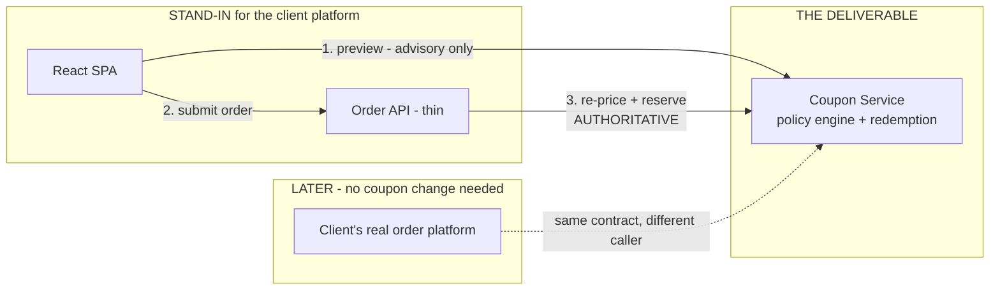

---

## 2. Scope

| In scope | Out of scope |
|---|---|
| Coupon Service: preview, reserve, confirm, release, admin CRUD | Payment capture, refunds, invoicing, tax engines |
| Policy engine with fully data-driven rules | Migrating or wrapping a pre-existing POS or website |
| Price calculation with a documented money contract | Loyalty points, gift cards, referrals, multi-code stacking |
| Redemption lifecycle: global + per-customer caps, idempotency | Admin **web UI** (the admin **API** is in scope) |
| Thin Order API as authoritative checkout caller | Multi-region, VNet, Private Link, WAF, Front Door |
| React SPA: choose pizzas, enter coupon, see totals, submit | Paid APIM tiers, load and penetration testing |
| APIM as the only public entry point, JWT + rate limiting | Kitchen, delivery, inventory, order tracking |
| Cosmos DB with a partitioning and concurrency design | Manual portal configuration as a deployment method |
| Bicep + pipeline provisioning from an empty resource group | |
| xUnit in CI, Reqnroll BDD against the deployed stack | |
| Serilog, correlation across hops, alerts, stated SLO | |

---

## 3. Architecture at a glance

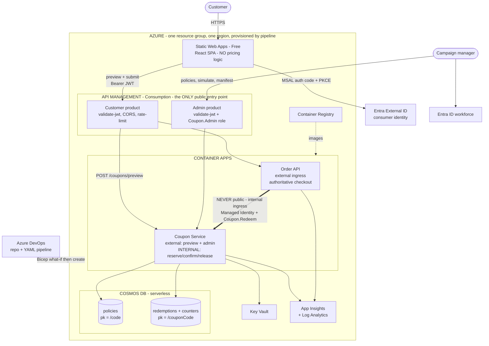

Two deliberate choices in that diagram:

1. **Mutation endpoints are on no public product.** Reserve, confirm and release sit on internal ingress, reachable only by the Order API's managed identity.
2. **The Order API does not call the Coupon Service through APIM.** A gateway hop inside a trust boundary adds latency and a cold start to checkout without adding security the app role does not already provide.

---

## 4. Components inside the Coupon Service

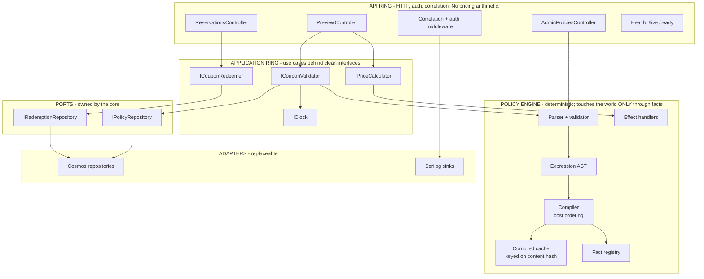

`Microsoft.Azure.Cosmos` types never leave the adapter ring. That is what makes the engine unit-testable with no emulator.

---

## 5. Policy engine — coupon rules as data

The engine must never be the reason a business requirement cannot ship. A campaign manager should be able to express a rule nobody anticipated, at runtime, with no build and no deployment.

### 5.1 Why not the specification pattern

The conventional choice — `ISpecification<Cart>` with `AndSpec`/`OrSpec` and one class per rule — has three structural limits. Rule **types** are C# classes, so a new predicate is still a deployment. A `CouponSpec` carrying `discountPercentage` conflates eligibility with pricing, leaving tiers, caps, cheapest-free and best-of inexpressible. And a boolean cannot explain itself, so it can never say "you are €3.10 short".

| | Composite Specification | Policy engine |
|---|---|---|
| A rule type is | a C# class | an expression over facts |
| A new predicate costs | build + deploy | a document edit |
| Money is | bolted onto a boolean node | its own grammar |
| Output is | pass / fail | decision + plan + trace + near-miss |

### 5.2 The model

Three separable concerns over one shared vocabulary.

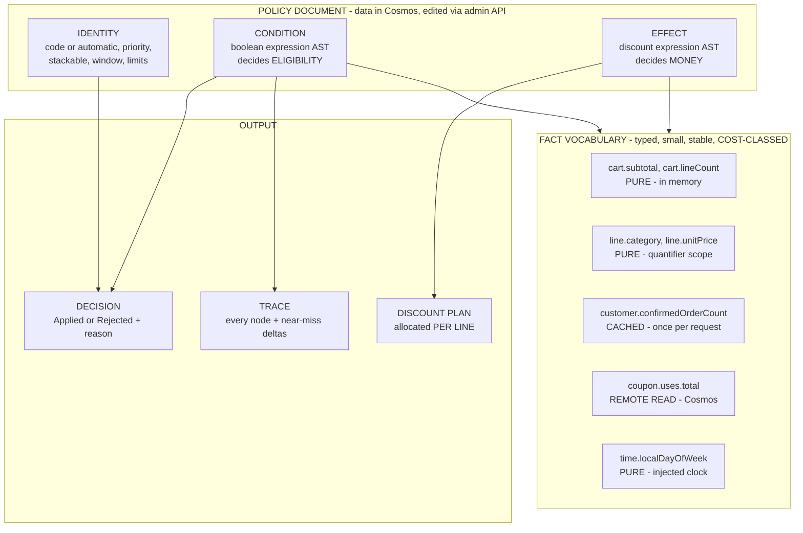

Seven generic node types — constant, fact, logical, comparison, quantifier, aggregate, arithmetic — cover every rule we have, instead of one class per business rule growing forever.

**The coupon code is identity, not a rule.** It is the partition key we looked the document up by, so evaluation starts already knowing the code matched. That removes a node from every tree and permits a policy with **no code at all**: an automatic promotion is the same document with `trigger: "automatic"`.

### 5.3 A policy document

```json
{
  "policyId": "veggie-summer-2026", "code": "VEGGIE15", "trigger": "code",
  "status": "Active", "version": 4, "engineSchema": "1.0", "contentHash": "sha256-9f2c…",
  "priority": 100, "stackable": false,
  "window": { "from": "2026-08-01T00:00:00Z", "to": "2026-09-30T23:59:59Z" },
  "limits": { "totalUses": 1000, "perCustomer": 1 },

  "condition": {
    "all": [
      { "gte": [ { "fact": "cart.subtotal" }, 25.00 ] },
      { "every": { "over": "cart.lines",
                   "where": { "eq": [ { "fact": "line.category" }, "Vegetarian" ] } } },
      { "any": [
          { "eq": [ { "fact": "customer.confirmedOrderCount" }, 0 ] },
          { "in": [ { "fact": "time.localDayOfWeek" }, ["Saturday", "Sunday"] ] }
      ] }
    ]
  },

  "effect": {
    "cap": { "max": 10.00,
             "of": { "percentage": { "value": 15,
                     "of": { "lines": { "where": { "eq": [ { "fact": "line.category" }, "Vegetarian" ] } } } } } }
  },

  "explain": { "title": "15% off vegetarian pizzas" }
}
```

`window` and `limits` are first-class fields rather than condition nodes, because the engine needs them for indexing, the reservation counter and TTL. They compile into the condition internally.

### 5.4 Grammar

Closed, typed, and deliberately **not** Turing-complete: no loops, no recursion, no user functions, no string evaluation.

| Condition form | Shape | Yields |
|---|---|---|
| Constant | `25.00`, `"Vegetarian"`, `["a","b"]` | value |
| Fact | `{ "fact": "cart.subtotal" }` | value |
| Logical | `{ "all": [..] }`, `{ "any": [..] }`, `{ "not": e }` | boolean |
| Comparison | `{ "gte": [a,b] }` + `gt`, `lte`, `lt`, `eq`, `neq` | boolean |
| Membership | `{ "in": [e,[..]] }`, `{ "between": [e,lo,hi] }` | boolean |
| Quantifier | `{ "every": { "over": "cart.lines", "where": e } }`, `some` | boolean |
| Aggregate | `{ "sum": sel }` + `count`, `min`, `max` | number |
| Arithmetic | `{ "add": [a,b] }` + `sub`, `mul`, `minOf`, `maxOf` | number |

| Effect | Shape | Purpose |
|---|---|---|
| `percentage` | `{ value, of: selector }` | Percentage off selected lines |
| `fixedAmount` | `{ amount }` | Flat reduction |
| `cheapestFree` | `{ from: selector, count }` | Cheapest N lines free |
| `nthItem` | `{ from, n, percentage }` | Buy-two-get-one and variants |
| `tiered` | `{ on: expr, tiers: [{from, percentage}] }` | Threshold ladders |
| `bestOf` | `[ effect, effect ]` | Largest discount, **computed** |
| `sum` | `[ effect, effect ]` | Additive combination |
| `cap` | `{ max, of: effect }` | Ceiling on any nested effect |

`bestOf` and `cap` are why effects are a grammar and not an enum. A **selector** (`{ "lines": { "where": expr } }`) is shared by both grammars, so a category restriction is written once and stays consistent between "does it apply" and "what does it reduce".

### 5.5 Pipeline: JSON to executable policy

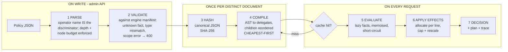

Stages 1–2 run on write, so a stored policy is guaranteed compilable and the request path can trust it.

### 5.6 Parsing

Single-key objects mean the operator name *is* the discriminator — no `type` field to keep in sync, no class registry to update.

```csharp
private static Expr Parse(JsonElement e, ParseBudget budget)
{
    budget.Spend();                                     // throws past the node ceiling

    if (e.ValueKind is JsonValueKind.Number) return Const.Of(e.GetDecimal());
    if (e.ValueKind is JsonValueKind.String) return Const.Of(e.GetString()!);
    if (e.ValueKind is JsonValueKind.Array)  return Const.Of(e.EnumerateArray().Select(ReadScalar));
    if (e.ValueKind is not JsonValueKind.Object) throw new PolicySyntaxException($"Bad token {e.ValueKind}");

    var op = SingleProperty(e);                         // exactly one key, else syntax error
    return op.Name switch
    {
        "fact"                        => new FactExpr(op.Value.GetString()!),
        "all" or "any" or "not"       => Logical(op.Name, op.Value, budget.Deeper()),
        "eq" or "neq" or "gt"
            or "gte" or "lt" or "lte" => Compare(op.Name, op.Value, budget.Deeper()),
        "in" or "between"             => Membership(op.Name, op.Value, budget.Deeper()),
        "every" or "some"             => Quantifier(op.Name, op.Value, budget.Deeper()),
        "sum" or "count"
            or "min" or "max"         => Aggregate(op.Name, op.Value, budget.Deeper()),
        _ => throw new PolicySyntaxException($"Unknown operator '{op.Name}'")
    };
}
```

The budget is a security control, not tidiness: a hostile document cannot produce a ten-thousand-node tree.

### 5.7 Facts, and compiling for cost

Facts are the only place the engine touches the outside world, and registering one is the entire cost of an unforeseen *input*:

```csharp
facts.Add("cart.subtotal",     ValueKind.Number, FactCost.Pure,
          (s, _) => ValueTask.FromResult(Value.Of(s.Cart.Subtotal)));

facts.Add("coupon.uses.total", ValueKind.Number, FactCost.RemoteRead,
          async (s, ct) => Value.Of(await s.Counters.TotalUsesAsync(s.Policy.Code!, ct)));
```

Because every operator is pure, the compiler may reorder `all`/`any` children **cheapest-first**:

```csharp
private (Compiled, FactCost) CompileLogical(LogicalExpr node, NodeId id)
{
    var parts = node.Operands
                    .Select((child, i) => CompileExpr(child, id.Child(i)))
                    .OrderBy(p => p.Cost)               // Pure → Cached → RemoteRead
                    .ToArray();

    Compiled all = async (scope, ct) =>
    {
        foreach (var (child, _) in parts)
            if (!(await child(scope, ct)).AsBool())
                return Value.False;                     // later I/O never runs
        return Value.True;
    };

    return (all, parts.Max(p => p.Cost));
}
```

So short-circuiting avoids **network round trips**, not just CPU. A cart failing the subtotal check is rejected with **zero Cosmos reads**.

### 5.8 The example campaign, compiled and evaluated

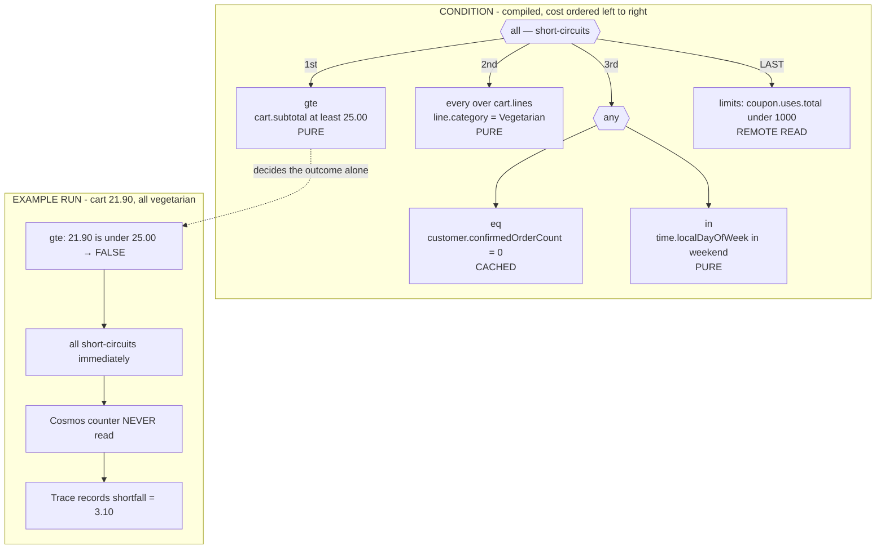

### 5.9 Trace, and the near-miss hint

A failed numeric comparison records exactly how far off it was:

```csharp
if (a.Kind is ValueKind.Number && b.Kind is ValueKind.Number)
    scope.Trace.NearMiss(id, node.Op, actual: a.Number, required: b.Number,
                         shortfall: Math.Abs(b.Number - a.Number));
```

```json
{
  "status": "Rejected",
  "reason": "MinimumOrderNotMet",
  "hint": { "shortfall": 3.10, "message": "Spend 3.10 more to use this offer" },
  "pricing": { "subtotal": 21.90, "discount": 0.00, "total": 21.90 }
}
```

No specification implementation produces that without a parallel reporting mechanism, because a boolean has discarded the information by the time it returns.

### 5.10 Applying effects

Effects produce a plan **allocated per line**, not a single number — which is what keeps partial refunds, per-line tax and "why was this line cheaper" answerable later.

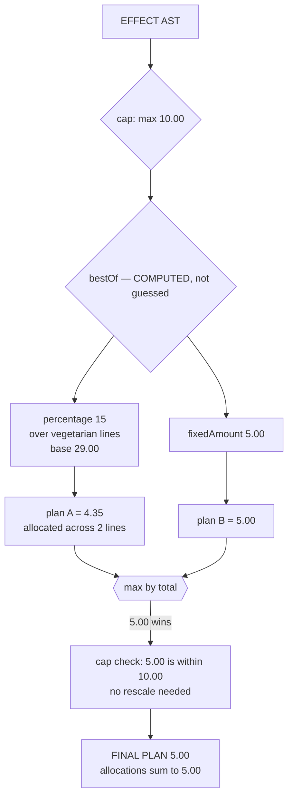

A cap that does bite rescales allocations proportionally and re-rounds, so allocations always sum to the capped total.

### 5.11 What is data and what is code

Overclaiming here is exactly what weakens the specification version, so the line is drawn precisely.

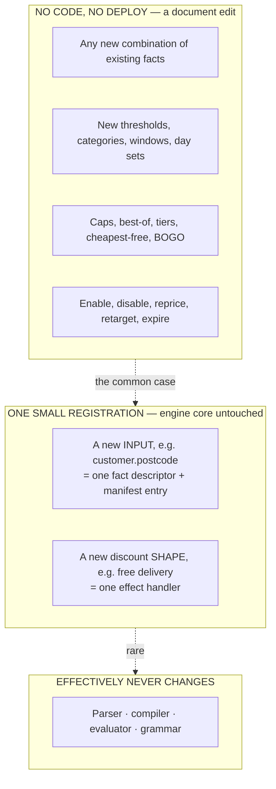

The claim is therefore precise: **new rules never need code; a new input needs one registration and no change to the engine.** In the specification design, every new predicate is a new class inside the engine's own hierarchy.

### 5.12 Governance: safe to be this dynamic

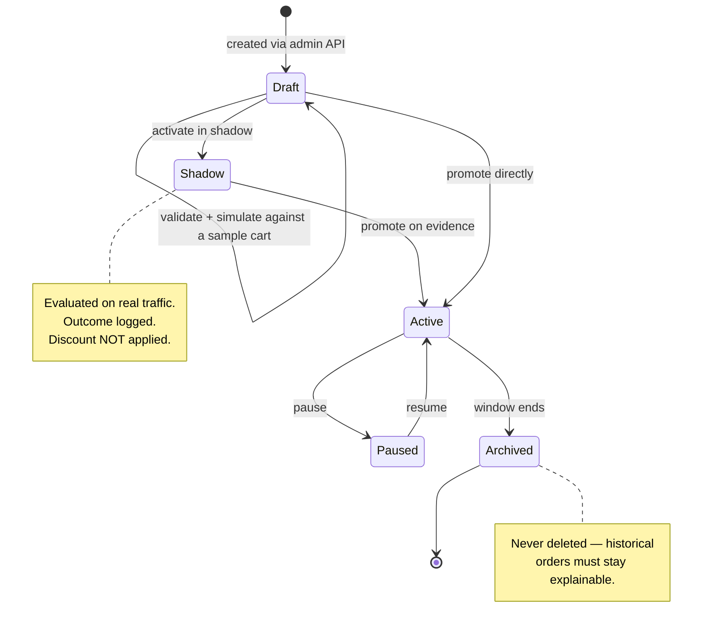

**Simulate** dry-runs a candidate against a sample cart and returns the decision plus full trace, saving nothing. **Shadow** buys a day of production evidence — how often it fires, what it would cost — before a customer sees it. For a system whose job is giving money away, that is the difference between a campaign and an incident.

The engine also publishes a **manifest** (`GET /policy-engine/manifest`) of every fact, operator, effect and limit. One document does three jobs: validates policies on write, drives the admin tool's field list dynamically, and documents the engine in a way that cannot drift from what is deployed.

### 5.13 Guardrails

| Concern | Control |
|---|---|
| Injection | Closed typed grammar. No script, regex or formula strings — no evaluator to attack. |
| Runaway evaluation | Parse budget on depth and node count, enforced before compilation. |
| Invalid documents | Manifest validation on write; the request path never sees an uncompilable policy. |
| Type confusion | Facts are typed; comparisons type-checked at validation, not at runtime. |
| Unbounded memory | Compiled cache size-limited with sliding expiry; negative lookups cached briefly to blunt code enumeration. |
| Timezone ambiguity | `time.local*` resolves against a configured zone. No implicit local time. |
| Non-determinism | `time.*` from an injected clock, so evaluation is reproducible in tests and replay. |
| Silent breakage | `engineSchema` per document; the engine refuses a schema it does not implement. |
| Auditability | Decisions store policy content hash, engine version and trace, so any historical price replays. |

---

## 6. Clean interfaces

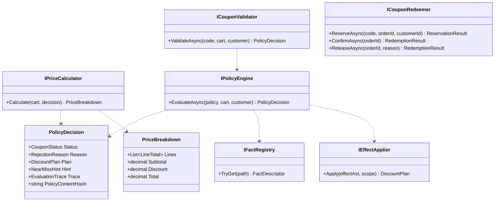

`IPriceCalculator` takes a **decision**, not a code, so it cannot apply an unvalidated discount. `PolicyDecision` carries the **content hash**, so a historical price stays reproducible after the campaign is edited, and a **trace**, so a rejection explains itself.

---

## 7. Money contract

`decimal` everywhere, never `double`. One currency per deployment (`EUR` default, from configuration, never inferred from the request).

| Concern | Rule |
|---|---|
| Line total | `unitPrice * quantity`, rounded to 2dp |
| Subtotal | Sum of rounded line totals |
| Percentage | `round(base * pct / 100, 2)`, `MidpointRounding.AwayFromZero` |
| Discount base | Subtotal, or only eligible lines when the selector restricts them |
| Cap | `discount = min(discount, base)`. Total reaches zero, never below. |
| Rounding order | Once per monetary value, at the point it is produced |
| Stacking | One coupon per order; a second code replaces the first in preview |

Worked example — 2 × Margherita @ 9.50 and 1 × BBQ Chicken @ 12.00 with `SAVE10` at 10% gives lines 19.00 and 12.00, subtotal 31.00, discount 3.10, total 27.90.

---

## 8. Redemption lifecycle

A capped coupon is a shared resource across concurrent checkouts, and checkout spans systems. Two-phase reservation gives the guarantee without a lock across services.

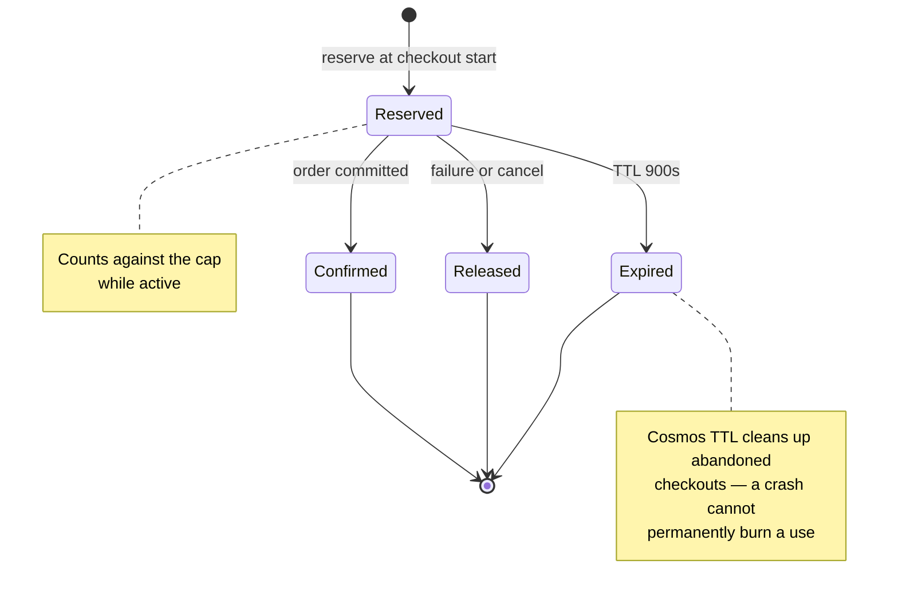

`Released` is the Order API's explicit compensation when persistence or payment fails after a reservation. `Expired` is the safety net for when that call never arrives because the caller itself died.

| Transition | Endpoint | Idempotency | Failure |
|---|---|---|---|
| Reserve | `POST /reservations` | Same `orderId` returns the existing reservation | `409` when the cap is consumed |
| Confirm | `POST /reservations/{orderId}/confirm` | Twice is a no-op | `404` unknown, `409` already released |
| Release | `POST /reservations/{orderId}/release` | Twice is a no-op | `404` unknown |
| Expire | TTL, automatic | — | Stops counting |

`orderId` is the idempotency key throughout, enforced by a **unique key in Cosmos** rather than by application checks, so a retried network call cannot double-count.

---

## 9. Flows

### 9.1 Preview — advisory

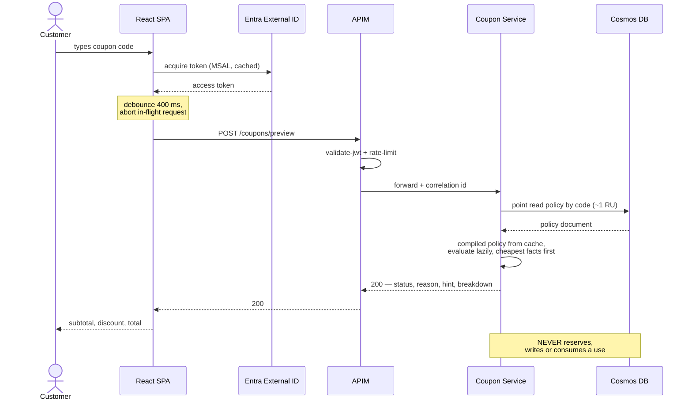

Preview answers `200` even when rejected, so the UI renders "this code expired on 30 August" instead of handling an error.

### 9.2 Checkout — authoritative

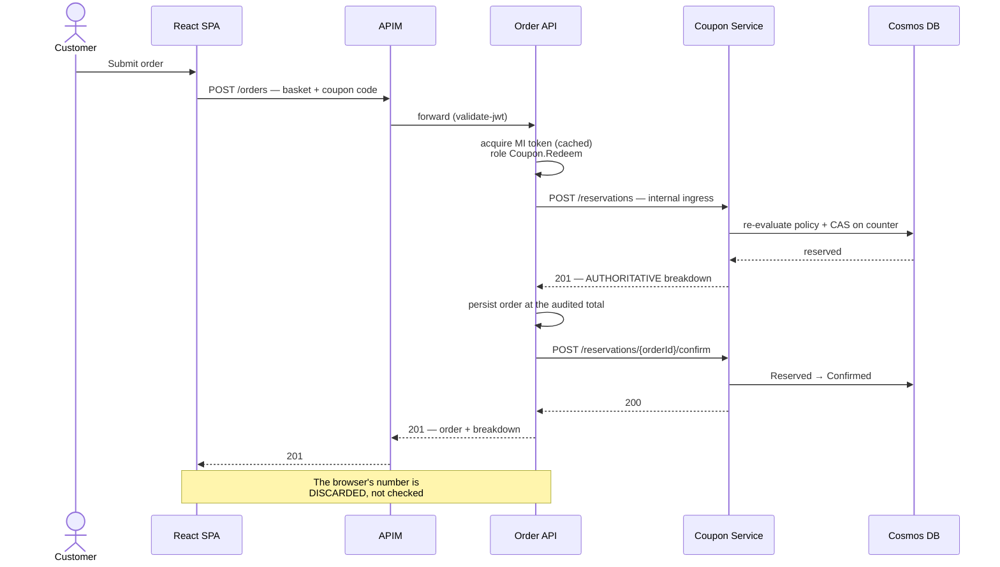

---

## 10. API surface

| Method | Path | Auth | Purpose |
|---|---|---|---|
| `POST` | `/coupons/preview` | Customer JWT | Evaluate against a basket; breakdown, status, near-miss hint |
| `GET` | `/health/live` · `/health/ready` | Anonymous | Liveness; readiness includes Cosmos |
| `POST` | `/reservations` | **MI + `Coupon.Redeem`** | Re-price authoritatively and reserve |
| `POST` | `/reservations/{orderId}/confirm` | **MI + `Coupon.Redeem`** | Commit the redemption |
| `POST` | `/reservations/{orderId}/release` | **MI + `Coupon.Redeem`** | Return the reserved use |
| `GET` `POST` | `/admin/policies` | `Coupon.Admin` | List, create (manifest-validated) |
| `GET` `PUT` `DELETE` | `/admin/policies/{id}` | `Coupon.Admin` | Read, update (ETag), soft-delete to `Archived` |
| `POST` | `/admin/policies/{id}/simulate` | `Coupon.Admin` | Dry run against a sample cart, returns trace |
| `POST` | `/admin/policies/{id}/status` | `Coupon.Admin` | Promote Draft → Shadow → Active → Paused |
| `GET` | `/policy-engine/manifest` | `Coupon.Admin` | Facts, operators, effects, limits |
| `GET` `POST` | `/pizzas` · `/orders` · `/orders/{id}` | Customer JWT | Order API (stand-in) |

Everything is versioned by path prefix `/v1`, mirrored in APIM routing.

### 10.1 Error contract

**A rejected coupon is a business outcome, not a transport error.**

| Situation | Status | Body |
|---|---|---|
| Preview, applies | `200` | `status: Applied` + breakdown |
| Preview, rejected | `200` | `status: Rejected`, `reason`, `hint`, full-price breakdown |
| Missing / invalid token | `401` | problem+json |
| Valid token, wrong role | `403` | problem+json |
| Malformed body, unknown pizza, qty < 1 | `400` | problem+json with field errors |
| Policy references an unknown fact (admin write) | `400` | node-level error |
| Reserve when cap consumed | `409` | `reason: UsageLimitReached` |
| Confirm / release unknown order | `404` | problem+json |
| Engine or rule failure | `500` | problem+json + correlation id, alert raised |

Reasons are a closed enum: `NotFound`, `Expired`, `NotYetActive`, `MinimumOrderNotMet`, `CategoryNotEligible`, `UsageLimitReached`, `PerCustomerLimitReached`, `NotFirstOrder`, `DayNotEligible`, `Disabled`. Errors are RFC 7807 and always carry the correlation id.

**Checkout policy.** A coupon that previewed valid but fails at checkout defaults to `AllowWithoutDiscount` — order placed at full price with the reason attached. A caller may send `couponPolicy: RequireDiscount` to get `409` instead. The ambiguity becomes the caller's explicit choice, with the safe default.

---

## 11. Data design

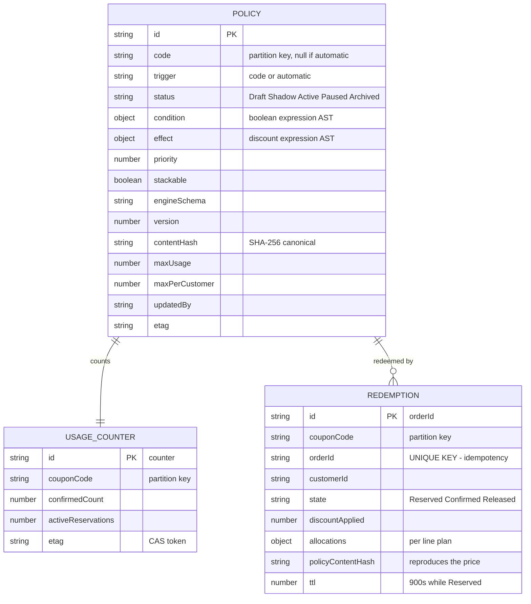

### 11.1 Why redemptions are partitioned by coupon code

The main correction to the reference proposal, which partitions by customer.

```mermaid
flowchart TB
    subgraph opt1 ["PARTITION BY customerId - rejected"]
        A1["Per-customer cap: single partition, cheap ✓"] --> A2["Global cap: CROSS-PARTITION aggregate ✗"]
        A2 --> A3["Cannot be made consistent under concurrency ✗"]
    end
    subgraph opt2 ["PARTITION BY couponCode - chosen"]
        B1["Global cap: single-partition counter + ETag ✓"] --> B2["Per-customer cap: filtered query, same partition ✓"]
        B2 --> B3["Idempotency: unique key on orderId in partition ✓"]
        B3 --> B4["All three in ONE transactional batch ✓"]
        B4 --> B5["Accepted cost: a viral code is a hot partition"]
        B5 --> B6["Escape hatch: sharded counters, CODE-0 to CODE-N"]
    end
```

The **global** cap is the constraint that must be transactionally correct; a per-customer cap tolerates a filtered read.

### 11.2 Reserve under concurrency

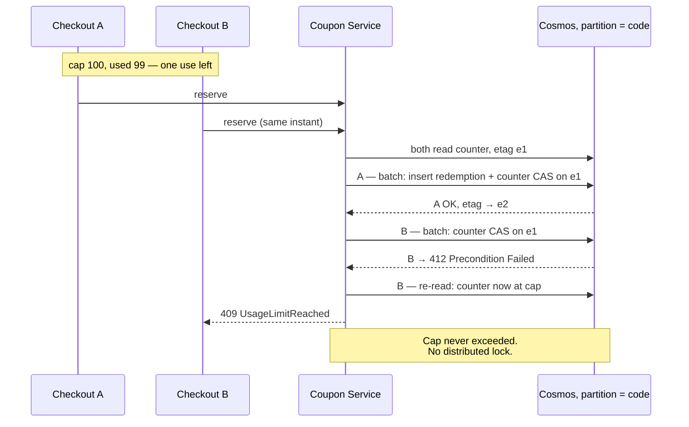

Retries use bounded exponential backoff with jitter, three attempts, then `409`.

### 11.3 Seeding and retention

Deployment seeds a deterministic policy set exercising every part of the grammar: `SAVE10` flat percentage, `FLAT5` fixed with a minimum, `VEGGIE15` quantifier + nested `any` + capped percentage, `BOGO` nth-item, `EITHER` a `bestOf`, `OLDCODE` expired, `LIMITED1` cap of one, `TUESDAY10` automatic with no code.

`REDEMPTION` holds `customerId`, which is personal data: retention defaults to 90 days for confirmed and released records; reserved records self-clean via TTL.

---

## 12. Security

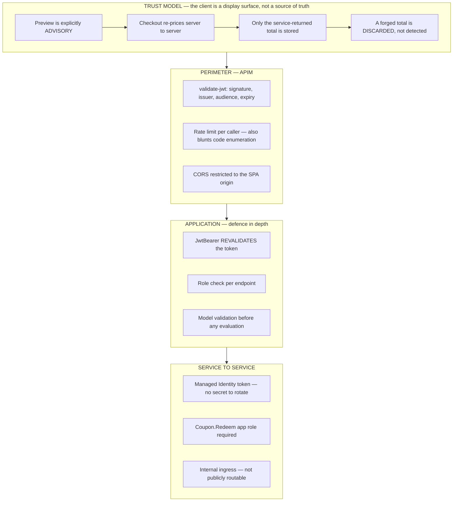

| Principal | Identity | Can reach |
|---|---|---|
| Customer | Entra External ID, auth code + PKCE | `preview`, order endpoints |
| Campaign manager | Workforce Entra ID, `Coupon.Admin` | admin policies, simulate, manifest |
| Order API | Managed Identity, `Coupon.Redeem` | reserve, confirm, release |

A customer token cannot reach mutation endpoints for **two independent reasons**: it lacks the role, and those routes are not published publicly. Either control alone would be a single point of failure.

| Threat | Control |
|---|---|
| Basket or total tampering | Server-side re-price at checkout |
| Coupon code enumeration | Rate limiting + generic `NotFound`, so ineligible and non-existent are indistinguishable |
| Double-spend of a capped coupon | ETag CAS + unique key on `orderId` |
| Browser calling mutation endpoints | Internal ingress + app role |
| Rule injection | Typed closed grammar, schema-validated; no evaluator exists |
| Secret leakage | Managed Identity + Key Vault; federated pipeline credential; no long-lived secrets |

Never logged: bearer tokens, Cosmos keys, customer contact details. `CouponCode` **is** logged — operationally essential, not personal data.

---

## 13. Scalability

The load profile is asymmetric and the design leans into it: a customer generates many **previews** and exactly one **checkout**.

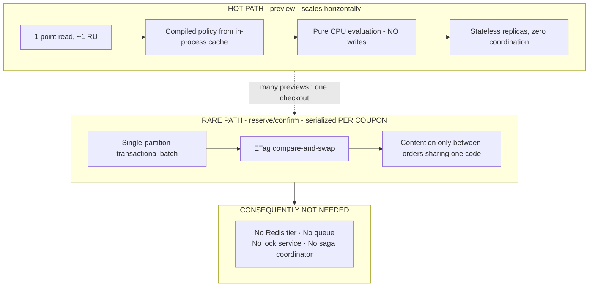

Each of those four is required the moment a design needs consistency *across* partitions. The data model was chosen so it never does.

| Order | Limit hit first | Symptom | Response |
|---|---|---|---|
| 1 | One logical partition for one coupon | Throttling on a viral code | Sharded counters `CODE#0..N`, summed on read |
| 2 | Scale-to-zero cold start | First call after idle is slow | `minReplicas: 1`, paid APIM tier |
| 3 | Cache stampede after an admin edit | Brief CPU spike across replicas | Bounded — trees are small; measured, not pre-optimised |
| 4 | Cosmos serverless ceiling | Throttling under sustained load | Provisioned throughput with autoscale |

**The architecture scales; the demo SKUs deliberately do not.** Production capacity is a parameter change, not a redesign: APIM Consumption → Standard v2, `minReplicas` 0 → 1+, Cosmos serverless → autoscale, counters → sharded. None of those touch domain code.

---

## 14. Performance

Ranked by CPU actually burned, the coupon logic is **not** the expensive part: JWT signature verification costs tens of microseconds per request, JSON serialisation and Serilog enrichment microseconds, policy evaluation sub-microsecond over 4–10 nodes, and `decimal` arithmetic nanoseconds. Latency ranks differently — the Cosmos point read (single-digit ms) dwarfs all CPU, and a cold start dwarfs the read. Two different problems, two different fixes.

| Optimisation | Why it pays |
|---|---|
| `CosmosClient` singleton, cached MI token | Both own expensive setup; per-request construction collapses throughput |
| Compiled policy cache, keyed on content hash | Parse and validate once, execute many; an edit invalidates automatically |
| Cheapest-first ordering, I/O last | Short-circuiting avoids **round trips**, not just cycles |
| ReadyToRun + trimming | Cuts JIT at startup — the cost scale-to-zero pays repeatedly |
| Source-generated JSON | Removes per-request reflection on API and Cosmos serialisation |
| `CancellationToken` to Cosmos | An aborted preview stops consuming CPU and RU |
| Static Web Apps CDN for SPA assets; Order API `ETag` + `Cache-Control` on `GET /v1/pizzas` | Edge-cached shell and conditional catalog fetches; APIM Consumption has no internal response cache (P-12) |
| Bounded caches | Prevents both a memory leak and a code-enumeration vector |
| No sync-over-async anywhere | One blocking wait starves the thread pool; worth more than every micro-optimisation combined |

**Not** optimised: allocations in a loop over five cart lines, or scaled integers instead of `decimal`. Measurable in a benchmark, invisible in production, and the second trades away correctness.

Measured, not asserted: App Insights separates request from dependency duration, Cosmos `RequestCharge` is a structured log field, the engine is pure so **BenchmarkDotNet** gives a real per-evaluation figure, and a counting fake fact provider proves short-circuiting skips I/O. On Container Apps consumption billing, vCPU-seconds *are* the invoice, so performance work and cost control are the same activity.

---

## 15. Resilience

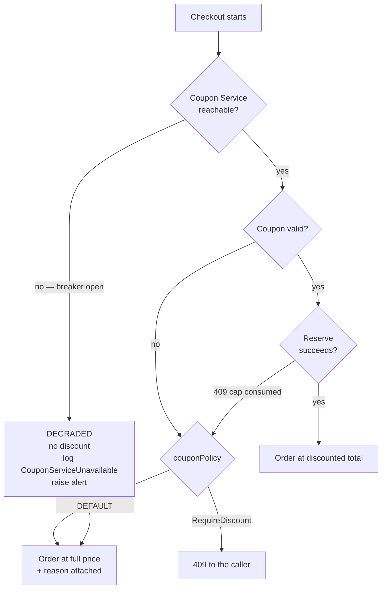

**Fail closed on the discount, fail open on the order.** A coupon outage must not stop people buying pizza, and must never hand out an unverified discount. Timeouts are 3s on reserve, retries bounded and only on idempotent operations, breaker state logged and alertable.

---

## 16. Observability

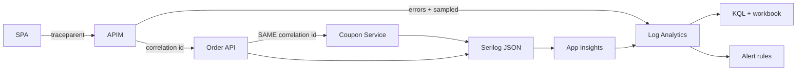

Every line carries `CorrelationId`, `UserId`, `CouponCode`, `OrderId`, `PolicyContentHash`, `Outcome`, `DurationMs`, `RequestCharge`. W3C `traceparent` propagates end to end, so one complaint resolves to one trace across gateway, order and coupon. Domain events: `CouponPreviewed`, `CouponApplied`, `CouponRejected`, `PolicyShadowEvaluated`, `ReservationCreated`, `RedemptionConfirmed`, `ReservationReleased`, `ReservationExpired`, `UsageLimitReached`, `CouponServiceUnavailable`.

Alerts: rejection rate above 50% over 15 minutes, any `500` on a redemption endpoint, breaker open, reserve p95 over 1s, readiness failing, Log Analytics daily cap approached.

**SLO (demo):** 99% of previews under 800 ms and 99% of reserves under 1s, measured at APIM, excluding cold starts — which are called out as a Consumption-tier characteristic rather than hidden.

---

## 17. Infrastructure

Topology is the Azure box in section 3. What matters here is the cost posture, because a demo that quietly bills is a failed demo.

| Resource | Tier | Cost posture |
|---|---|---|
| API Management | **Consumption** | First 1M calls/month included. Named explicitly — the sample leaves the tier open, and Developer tier is a real monthly charge. |
| Container Apps | Consumption | Monthly free grant of vCPU-s, GiB-s and requests covers demo traffic. Scales to zero. |
| Static Web Apps | Free | SPA hosting + CDN |
| Cosmos DB | Free tier if unused in the subscription, else serverless | Free tier is one account per subscription, enabled at creation only |
| App Insights + Log Analytics | Pay as you go | Small ingest allowance, short retention, daily cap configured |
| Key Vault | Standard | Per-operation, effectively nil |
| Container Registry | **Basic — the only non-free item** | ~$5/month. Alternatives: public registry, or the App Service route |
| Entra External ID | Free MAU allowance | Confirm current threshold at implementation |

**Hosting decision.** Container Apps is recommended because **internal ingress** makes "mutation endpoints are not publicly reachable" true in *infrastructure*, not only in policy; it also scales to zero and gives revisions and rollback. App Service **F1** is the strict-zero-cost fallback, at the cost of losing internal ingress (the app role becomes the only control) and sharing a 60 CPU-minute daily quota between two apps. This is one Bicep parameter and we confirm it before provisioning.

```text
infra/bicep/
  main.bicep · main.demo.bicepparam
  modules/  observability · identity · keyvault · cosmos
            containerapps · appservice (fallback) · apim · apim-api · staticwebapp
  policies/ customer-product.xml · admin-product.xml
```

Every deployment runs `what-if` before `create`. Parameters carry no secrets. Resources are tagged `project`, `env`, `owner` so cost can be filtered and the environment deleted in one command.

---

## 18. CI/CD

```mermaid
flowchart LR
    S1["1 BUILD<br/>restore, analyzers,<br/>warnings as errors"]
    S2["2 TEST<br/>xUnit + engine +<br/>property-based, coverage gate"]
    S3["3 PACKAGE<br/>images, OpenAPI,<br/>SPA bundle"]
    S4["4 PROVISION<br/>Bicep what-if<br/>published, then create"]
    S5["5 DEPLOY<br/>images, SPA,<br/>APIM import + policies"]
    S6["6 SEED<br/>deterministic policies<br/>idempotent"]
    S7["7 BDD<br/>Reqnroll through APIM,<br/>run-scoped data"]
    S8["8 VERIFY<br/>smoke, results,<br/>optional teardown"]

    S1 --> S2 --> S3 --> S4 --> S5 --> S6 --> S7 --> S8
    S2 -.->|"fail"| X1["FAILS - nothing deployed"]
    S5 -.->|"readiness probe must pass"| S6
    S7 -.->|"any scenario fails"| X2["Stage fails, environment flagged"]
```

Azure authentication uses a **workload-identity federated** service connection — no long-lived secret in the pipeline (P-13, AC-9.3). Rollback is a previous-revision redeploy for services and a previous-template run for infrastructure.

**Branching (P-14):** one `azure-pipelines.yml` serves PR CI and both CD environments. Pull requests into `develop` or `main` run Build + Test only. A merge to `develop` provisions and deploys to `rg-coupon-demo` via `main.dev.bicepparam`; a merge to `main` targets `rg-coupon-prod` via `main.prod.bicepparam`. Feature work branches from `develop` and opens pull requests back to `develop`; the operator merges `develop` → `main` separately after the non-prod CD path is green. See `docs/deployment.md` and `docs/pipeline-prerequisites.md`.

One-time manual prerequisites, and nothing beyond these: create the Azure DevOps project, create the service connection, grant app-registration permission. Everything after is pipeline-driven — which is what the brief means by "no manual deployment or configuration steps".

---

## 19. Testing

```mermaid
flowchart TB
    subgraph ci ["STAGE 1 - CI, no infrastructure"]
        U0["Parser + validator<br/>unknown operator/fact, type mismatch,<br/>depth + node budgets"]
        U1["Compiler + evaluator<br/>cost ordering, operator truth tables,<br/>near-miss deltas"]
        U2["Effects + pricing<br/>bestOf, cap rescale, cheapest-free,<br/>rounding, allocations sum"]
        U3["Property-based<br/>discount never negative,<br/>never exceeds eligible base"]
        U4["Redeemer, fake repo<br/>idempotency, CAS conflict"]
        U5["API contract, WebApplicationFactory<br/>400 / 401 / 403"]
        U0 --> U1 --> U2 --> U3 --> U4 --> U5
    end
    subgraph post ["STAGE 2 - post-deploy, real stack"]
        B1["Reqnroll BDD through APIM"] --> B2["Auth negative paths"]
        B2 --> B3["Reserve/confirm/release round trip"] --> B4["Concurrency: two reservations, one wins"]
    end
    U5 --> B1
```

**Test data isolation** — the fix for the sample's flakiest area. Its scenarios expect `LIMITED10` to be at its cap in live Cosmos; run the pipeline twice and "limit exceeded" and "limit not reached" contradict each other. Our run generates a prefix (`RUN7F3A_`), seeds exactly the policies it needs via the admin API, runs against those only, and deletes them in teardown. Repeatable and parallel-safe.

The engine test worth singling out: register a **counting** fact provider for `coupon.uses.total`, evaluate a policy whose cheap branch fails, and assert it was called **zero** times. That proves the performance claim rather than asserting it.

```gherkin
Feature: Coupon validation and order pricing

  Scenario: Percentage coupon reduces the total
    Given a cart with 2 x "Margherita" at 9.50 and 1 x "BBQ Chicken" at 12.00
    And an active policy "SAVE10" giving 10 percent off
    When the customer previews the coupon
    Then the subtotal is 31.00 and the discount is 3.10 and the total is 27.90

  Scenario: Expired coupon is reported, not thrown
    Given a policy "OLDCODE" whose window ended yesterday
    Then the response status is 200 and the reason is "Expired"

  Scenario: A rejection tells the customer how close they were
    Given a cart totalling 21.90 and a policy requiring a minimum of 25.00
    Then the reason is "MinimumOrderNotMet" and the hint shortfall is 3.10

  Scenario: A new rule ships without a deployment
    Given a new policy created via the admin API with condition
      """
      { "gte": [ { "fact": "cart.lineCount" }, 3 ] }
      """
    When a cart with 3 lines previews that policy
    Then the coupon status is "Applied" and no service was redeployed

  Scenario: A capped best-of offer picks the larger discount and stops at the ceiling
    Given a cart totalling 200.00
    And a policy offering the better of 15 percent or 5.00 flat, capped at 10.00
    Then the discount is 10.00 and the allocations sum to 10.00

  Scenario: An automatic policy applies with no code entered
    Given an active automatic policy "TUESDAY10" and today is Tuesday
    When the customer previews with no coupon code
    Then a 10 percent discount is applied

  Scenario: A policy referencing an unknown fact is rejected on write
    When an administrator submits a condition referencing "customer.zodiacSign"
    Then the response status is 400 and the error identifies the unknown fact

  Scenario: A shadow policy is evaluated but never discounts
    Given a policy "TRIAL20" in Shadow status that would apply
    Then the discount is 0.00
    And a "PolicyShadowEvaluated" event records what it would have given

  Scenario: Usage limit is enforced across concurrent checkouts
    Given a policy "LIMITED1" with a maximum usage of 1
    When two orders reserve "LIMITED1" at the same time
    Then exactly one succeeds and the other is rejected with "UsageLimitReached"

  Scenario: Client-side tampering is ignored
    Given a cart whose true total is 31.00
    When the client submits the order claiming a total of 1.00
    Then the stored order total is 27.90 with coupon "SAVE10"

  Scenario: Mutation endpoints reject a customer token
    Given a valid customer token without the "Coupon.Redeem" role
    When the reservations endpoint is called
    Then the response status is 403
```

The last three prove the *architecture* rather than the arithmetic: tampering is ineffective, concurrency is safe, privilege separation holds.

---

## 20. Frontend

React 18 + TypeScript + Vite + Material UI on Static Web Apps. Catalog → cart → coupon input (debounced 400 ms, in-flight request aborted) → preview via APIM → subtotal, discount, total plus any rejection reason and near-miss hint → submit → confirmation at the **server** total.

The SPA holds **no** pricing rules. Every previewed price is a hint; the confirmation total comes from the order response. MSAL with authorization code + PKCE; no secret ships to the browser.

---

## 21. Repository layout

```text
src/  Api · Application · Domain · Engine · Infrastructure · OrderApi · web
tests/ UnitTests · EngineTests · Benchmarks · ApiTests · Bdd
infra/ bicep (delivery) · terraform (documented alternative, not wired to CI)
data/  pizzas.json · policies.seed.json
docs/  this file · deployment · auth
azure-pipelines.yml
```

`Domain` holds the cart, the policy AST and the price breakdown; `Engine` holds the parser, validator, compiler, fact registry and manifest; `Infrastructure` holds the Cosmos repositories and Serilog wiring. `Engine` has no Azure dependency at all, which is why its tests need no emulator.

**On IaC tooling:** Bicep is the delivery choice — native to Azure and Azure DevOps, no remote state store to create and secure, and "deploy from scratch" is one deployment command. The author has production Terraform experience and the same graph maps onto `azurerm`; `infra/terraform` documents that route without maintaining a second live stack. One tool per environment.

---

## 22. Architecture decisions

| ID | Decision | Rationale | Rejected |
|---|---|---|---|
| 1 | Standalone Coupon Service | The brief introduces a coupon service; the ordering platform stays untouched and independently deployable | Coupons inside the order service, coupling campaigns to order releases |
| 2 | Preview advisory, checkout authoritative | Removes client-side tampering while keeping the UI responsive | Trusting the client total |
| 3 | Policy engine: expressions over a typed fact model | New rules are data; vocabulary is small and stable while combinations are unbounded | Composite Specification, where every new predicate is a class and a deploy |
| 4 | Condition and effect as separate grammars | Eligibility and pricing are different concerns; makes tiers, caps and best-of expressible | A discount scalar attached to a boolean node |
| 5 | Closed non-Turing-complete grammar + parse budgets | Fully dynamic with no injection or runaway-execution surface | Roslyn scripting, Lua, user-supplied regex |
| 6 | Compile to delegates, cached on content hash | Parse and validate once, execute many; an edit invalidates automatically | Interpreting per request, or caching on code + version |
| 7 | Compile-time cost ordering, I/O last | Turns short-circuiting into avoided round trips, not just avoided CPU | Evaluating in document order |
| 8 | Trace with near-miss deltas, per-line allocation | Enables "spend 3.10 more"; keeps refunds, per-line tax and historical prices answerable | A boolean plus a reason string and a scalar discount |
| 9 | Manifest-driven validation, simulate, shadow | One source of truth for capability; money-moving rules proven before customers see them | Hand-written docs, hard-coded admin fields, editing live |
| 10 | Coupon code as identity, not a rule node | Removes a node from every tree; enables code-free automatic promotions | Testing the code inside the condition |
| 11 | Reserve, confirm, release | Enforces caps across systems without distributed locks | Decrement on preview, leaking uses on abandoned carts |
| 12 | Redemptions partitioned by coupon code, ETag CAS on the counter | Counter, per-customer check and idempotency key in one partition; correct under concurrency with no lock service | Partition by customer, making the global cap a cross-partition aggregate; read-then-write, which oversells |
| 13 | Managed Identity + app role for the internal hop | No secret to rotate; mutation paths unreachable from a browser | Shared API key, or public mutation endpoints |
| 14 | Entra External ID for customers | Consumer identity product; MSAL is the expected client | Workforce tenant for consumers |
| 15 | APIM Consumption | Meets the APIM requirement inside a free call grant | Developer tier, a real monthly charge for a demo |
| 16 | Container Apps, App Service fallback | Internal ingress makes private endpoints private in infrastructure, not just in policy | App Service Free only, where every endpoint is addressable |
| 17 | Bicep for delivery | Native, stateless, one command | Terraform, which adds a state backend to secure |
| 18 | Rejections are `200` with a reason | A rejected coupon is a business outcome; one contract clients can code against | Mixed 400/404 per rejection type |
| 19 | Fail closed on discount, fail open on order | An outage must not stop sales, nor grant unverified discounts | Failing checkout, or honouring the client's claim |
| 20 | `decimal` for all money | Correctness outweighs speed; cost is negligible beside signature verification | `double` or scaled integers |
| 21 | Run-scoped BDD test data | Post-deploy suite repeatable and parallel-safe | Fixed shared codes whose state drifts |

---

## 23. Risks

| Risk | Impact | Mitigation |
|---|---|---|
| APIM and Container Apps cold starts | Slow first call, smoke tests time out | Generous post-deploy timeouts, readiness gate before BDD, documented as a tier characteristic |
| Cosmos free tier already used | Provisioning fails | Parameter switches to serverless, negligible at demo volume |
| Container Registry is not free | Small monthly charge | Public registry or App Service fallback; flagged before provisioning |
| Subscription has a spending limit | APIM or Cosmos cannot be created | Confirm the offer before the first run; pipeline fails fast with a clear message |
| Entra External ID tenant unavailable | Customer sign-in not demonstrable | Fall back to workforce tokens, document the difference |
| No real order platform to integrate with | The double-validation flow has no upstream | Thin Order API stand-in with an identical contract |
| Hot partition on a viral coupon | Write throttling | Sharded counters, documented and measurable |
| Engine is a bigger build than a spec tree | Wave 1 slips | Phase it: condition grammar + `percentage`/`fixedAmount`/`cap` first; `cheapestFree`, `nthItem`, `tiered` are additive handlers needing no engine change |

---

## 24. Delivery waves

1. **Engine** — grammar, parser, validator, compiler, effects, unit and property tests.
2. **Persistence and lifecycle** — Cosmos model, reserve/confirm/release, admin API, simulate and shadow.
3. **Edges** — auth, APIM, Order API, contract tests.
4. **Automation** — Bicep, pipeline, seeding, post-deploy BDD.
5. **Frontend**, then **docs, alerts and walkthrough**.

Waves 1 and 2 need no Azure access, so implementation can start immediately; the environment is only required from wave 3.

---

## 25. Assumptions

1. No existing pizza ordering codebase or environment is provided; we build the thin Order API as the authoritative caller.
2. The pizza catalog is a one-time snapshot of a public mock menu, committed as `data/pizzas.json`; nothing is fetched at runtime.
3. One coupon per order. Stacking, loyalty and gift cards out of scope — though the engine models policy resolution, so a site-wide promotion alongside codes is a configuration change.
4. No payment provider; the confirm step stands in for "payment captured".
5. Single currency, `EUR` default, configurable. No tax line unless a rate is specified.
6. Rejected coupons default to `AllowWithoutDiscount` at checkout.
7. Policies are seeded at deployment and managed through the admin API; no admin UI.
8. Azure DevOps project, an enabled subscription and app-registration permission are provided before wave 3.
9. Demo environment only. No production hardening, HA or DR commitments.

---

## 26. What we need to proceed

| Need | Why | Blocks |
|---|---|---|
| Azure DevOps project, contributor + pipeline rights | Repository and CI/CD deliverable | Wave 4 |
| Azure subscription, contributor on a resource group, enabled and not spending-limited | Provisioning APIM and Cosmos | Wave 3 |
| Federated service connection, or permission to create one | Deployment with no manual steps and no stored secret | Wave 4 |
| App-registration permission, or tenant id + API app id + audience | JWT validation and the app roles | Wave 3 |
| Entra External ID tenant, if customer sign-in is expected | Consumer identity | Wave 3 |
| Region choice | APIM Consumption and Container Apps availability | Wave 3 |
| Confirm hosting: Container Apps (accepts registry cost) or App Service (strictly zero) | Infrastructure parameter | Wave 4 |
| Confirm default checkout policy on a failed coupon | Contract | Wave 1 |
| Confirm whether a real order platform exists after all | Would replace our stand-in | Wave 3 |
