# Pizza Coupon Service Solution Architecture

Coupon support for the pizza ordering platform. This is the detailed design proposal:


|                 |                                                                                                  |
| --------------- | ------------------------------------------------------------------------------------------------ |
| **Runtime**     | ASP.NET Core Web API, .NET 10                                                                    |
| **Rule engine** | Composite Specification pattern over JSON rule trees                                             |
| **Data**        | Azure Cosmos DB for NoSQL, serverless or free tier                                               |
| **Gateway**     | Azure API Management, Consumption tier                                                           |
| **Identity**    | Entra External ID for customers, workforce Entra ID for admin, Managed Identity between services |
| **Hosting**     | Azure Container Apps, with App Service as the strict zero-cost fallback                          |
| **IaC**         | Bicep                                                                                            |
| **CI/CD**       | Azure DevOps multi-stage YAML                                                                    |
| **Logging**     | Serilog to Application Insights and Log Analytics                                                |
| **Tests**       | xUnit and FluentAssertions in CI, Reqnroll BDD post-deploy                                       |


---


## 1. Executive summary

Coupons are introduced as a **standalone service**, not as a change inside the ordering platform. The ordering platform keeps owning the basket, the customer and the checkout; it asks the Coupon Service what a coupon is worth and records the answer.

Two flows, deliberately separated:

- **Interactive preview** — the browser asks, through API Management, what a coupon would do to the current basket. Debounced, read-only, cheap, and **advisory**.
- **Authoritative checkout** — on submit, the Order API re-prices the basket server to server and reserves the coupon before it commits the order. The browser's number is never trusted.

Coupon eligibility is **data, not code**. A campaign is a JSON rule tree stored in Cosmos DB and compiled at runtime into a specification tree, so new campaigns ship without a deployment.

Usage limits are enforced through a **reserve, confirm, release** lifecycle with idempotent transitions, so two concurrent checkouts cannot both consume the last available use.

### Honest note on the starting position

The brief describes an existing pizza website. No such codebase or environment has been made available to us. We therefore build **two** components: the Coupon Service, which is the actual deliverable, and a **thin Order API** that plays exactly the role the client's platform plays in the diagrams below. The Coupon Service contract does not change when the real platform replaces our stand-in; only the caller's identity and base URL change.

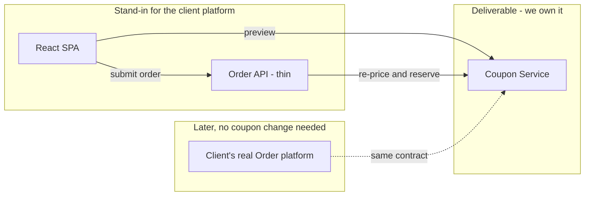


---


## 2. Scope


### In scope

- Standalone Coupon Service: preview, reserve, confirm, release, admin CRUD.
- Rule engine with composable AND and OR rule trees stored as JSON.
- Price calculation with a documented money and rounding contract.
- Redemption lifecycle with global and per-customer usage caps and idempotency.
- Thin Order API acting as the authoritative checkout caller.
- React SPA: choose pizzas, enter coupon, see subtotal, discount and total, submit.
- APIM as the only public entry point, with JWT validation and rate limiting.
- Entra External ID for customers, app roles for admin and for the service-to-service hop.
- Cosmos DB persistence with a partitioning and concurrency design.
- Bicep for every resource; Azure DevOps pipeline that provisions and deploys from an empty resource group.
- xUnit unit and service tests in CI; Reqnroll BDD against the deployed stack.
- Serilog structured logging, correlation across all hops, alerts and a stated SLO.
- Documentation: architecture, deployment, authentication, assumptions.


### Out of scope

- Payment capture, refunds, invoicing and tax engines.
- Migrating or reverse engineering any pre-existing POS or website.
- Loyalty points, gift cards, referral schemes, coupon stacking across multiple codes.
- Admin web UI (the admin **API** is in scope; management is done through it).
- Multi-region, VNet injection, Private Link, WAF, Front Door.
- Paid APIM tiers, autoscale tuning, load and penetration testing.
- Kitchen, delivery, inventory and order-tracking domains.
- Manual portal configuration as a deployment method.

---


## 3. Context

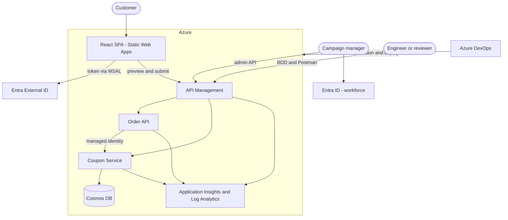


---


## 4. Containers

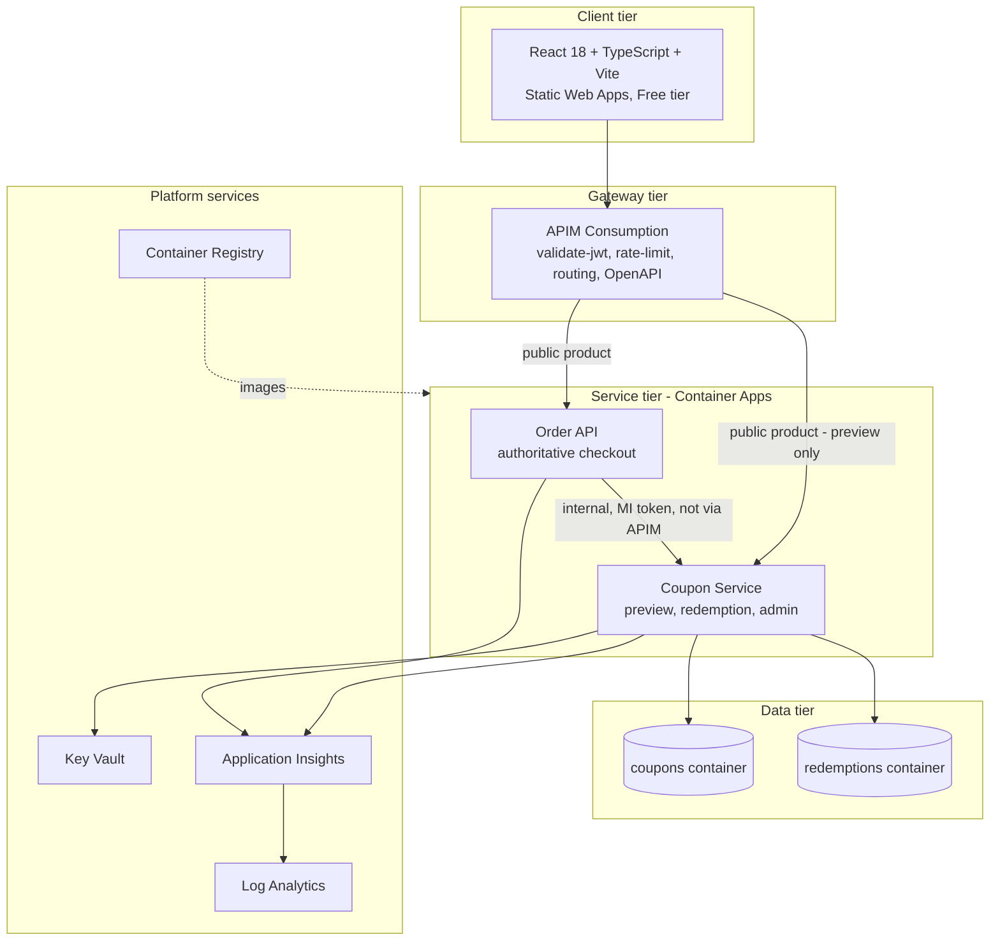


Two points the diagram is making on purpose:

1. **Mutation endpoints are never on the public product.** Reserve, confirm and release are reachable only from the Order API's managed identity on the internal ingress.
2. **The Order API does not call the Coupon Service through APIM.** A gateway hop inside a trust boundary adds latency and a cold start to the checkout path without adding security that the app role does not already give us.

---


## 5. Components inside the Coupon Service

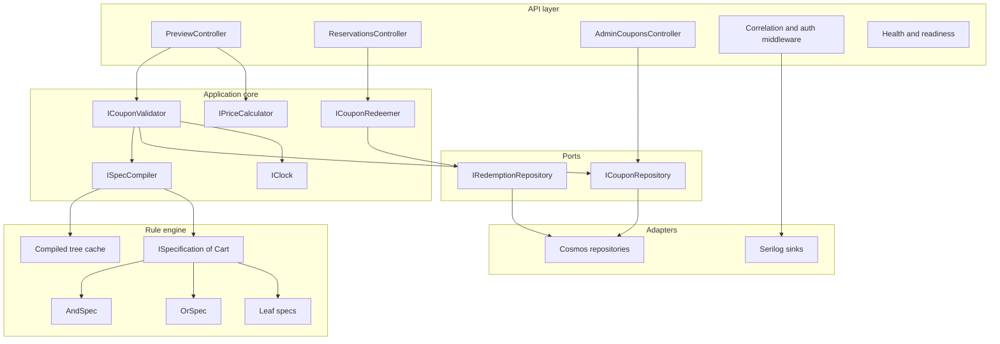


| Ring             | Rule                                                                                      |
| ---------------- | ----------------------------------------------------------------------------------------- |
| API              | HTTP, auth, correlation. No pricing arithmetic.                                           |
| Application core | Use cases and the clean interfaces the brief asks for. No Cosmos types, no `HttpContext`. |
| Rule engine      | Pure evaluation over a `Cart`. Deterministic, no I/O, `IClock` injected.                  |
| Ports            | Interfaces owned by the core.                                                             |
| Adapters         | Cosmos SDK, Serilog, configuration. Replaceable.                                          |


`Microsoft.Azure.Cosmos` types never leave the adapter ring. That is what makes the engine unit-testable without an emulator.

---


## 6. Clean interfaces

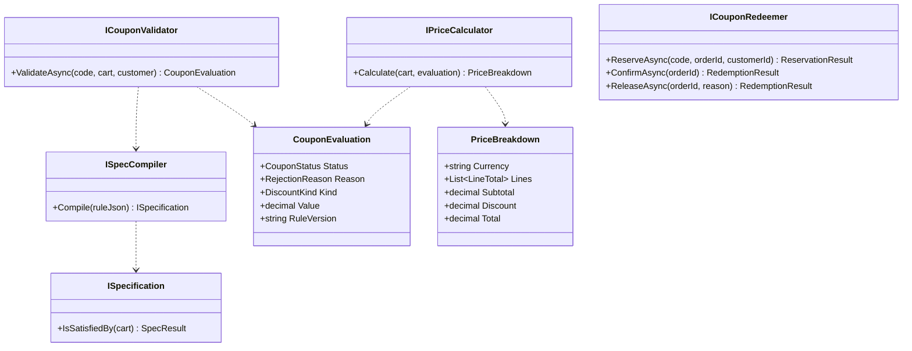


Two properties worth calling out. `IPriceCalculator` takes an **evaluation**, not a coupon code — it cannot accidentally re-validate or apply an unvalidated discount. And `CouponEvaluation` carries `RuleVersion`, so a stored order can be explained months later even after the campaign changed.

---


## 7. Rule engine


### 7.1 Structure

Coupon eligibility is a tree. Leaves test one fact about the cart or the customer; composites combine them.

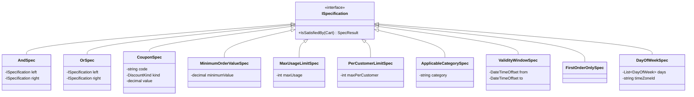


`SpecResult` is not a boolean. It carries the **reason** a leaf failed, so a rejection can be explained to the customer instead of returning a bare "not valid".

### 7.2 Leaf rules


| `ruleType`           | Parameters                      | Tests                                                            |
| -------------------- | ------------------------------- | ---------------------------------------------------------------- |
| `Coupon`             | `code`, `discountKind`, `value` | Code matches, case-insensitive and trimmed; carries the discount |
| `MinimumOrderValue`  | `minimumValue`                  | Subtotal is at or above the threshold                            |
| `MaxUsageLimit`      | `maxUsage`                      | Confirmed plus active reservations are below the cap             |
| `PerCustomerLimit`   | `maxPerCustomer`                | This customer is below their own cap                             |
| `ApplicableCategory` | `category`                      | Every discountable line is in the category                       |
| `ValidityWindow`     | `from`, `to`                    | Now is inside the campaign window                                |
| `FirstOrderOnly`     | none                            | Customer has no confirmed prior order                            |
| `DayOfWeek`          | `days`, `timeZoneId`            | Local day is in the list                                         |


`DayOfWeek` carries an explicit `timeZoneId`. A "weekend only" campaign is otherwise ambiguous the moment a customer orders near midnight.

### 7.3 From JSON to a tree

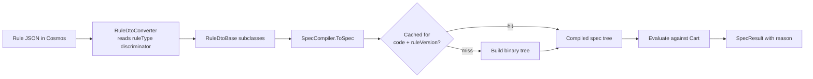


Multi-child arrays fold into nested binary nodes, so an `And` with four children becomes `And(And(And(a,b),c),d)`. Evaluation short-circuits, and the cache is keyed on coupon code plus rule version so an admin edit invalidates it without a restart.

### 7.4 Example — nested campaign

```json
{
  "ruleType": "And",
  "rules": [
    { "ruleType": "Coupon", "code": "VEGGIE15", "discountKind": "Percentage", "value": 15 },
    { "ruleType": "ValidityWindow", "from": "2026-08-01T00:00:00Z", "to": "2026-09-30T23:59:59Z" },
    { "ruleType": "ApplicableCategory", "category": "Vegetarian" },
    {
      "ruleType": "Or",
      "rules": [
        { "ruleType": "FirstOrderOnly" },
        { "ruleType": "MinimumOrderValue", "minimumValue": 25.00 }
      ]
    }
  ]
}
```

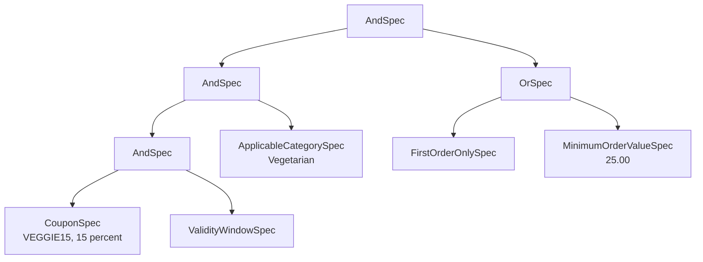


Adding a campaign is an admin API call. No build, no deploy, no code review.

### 7.5 Guardrails the pattern needs

- **Schema validation on write.** The admin API rejects unknown `ruleType` values, missing parameters and trees deeper than a configured limit, so a bad document can never reach evaluation.
- **Rule versioning.** Every write increments `ruleVersion`. Evaluations record which version priced an order.
- **No expressions.** Rules are typed nodes, never a script or a formula string. There is nothing to inject.

---


## 8. Money contract

Underspecified pricing is where coupon systems leak money, so this is stated rather than implied.


| Concern             | Decision                                                                                               |
| ------------------- | ------------------------------------------------------------------------------------------------------ |
| Type                | `decimal` everywhere. Never `double` or `float`.                                                       |
| Currency            | Single currency per deployment, `EUR` by default, from configuration. Never inferred from the request. |
| Line total          | `unitPrice * quantity`, rounded to 2 decimals.                                                         |
| Subtotal            | Sum of rounded line totals.                                                                            |
| Percentage discount | `round(discountBase * percentage / 100, 2)`, `MidpointRounding.AwayFromZero`.                          |
| Discount base       | Subtotal, or only the eligible lines when the campaign is category-restricted.                         |
| Cap                 | `discount = min(discount, discountBase)`. Total can reach zero and never goes below it.                |
| Total               | `subtotal - discount`.                                                                                 |
| Rounding order      | Round once per monetary value, at the point it is produced. No repeated rounding.                      |
| Stacking            | One coupon per order. A second code replaces the first in preview.                                     |


Worked example, two Margherita at 9.50 and one BBQ Chicken at 12.00, with `SAVE10` at ten percent:


| Step     | Value           |
| -------- | --------------- |
| Lines    | 19.00 and 12.00 |
| Subtotal | 31.00           |
| Discount | 3.10            |
| Total    | 27.90           |


---


## 9. Redemption lifecycle

A coupon with a usage cap is a shared resource across concurrent checkouts, and the checkout spans systems. A two-phase reservation gives us the guarantee without holding a lock across services.

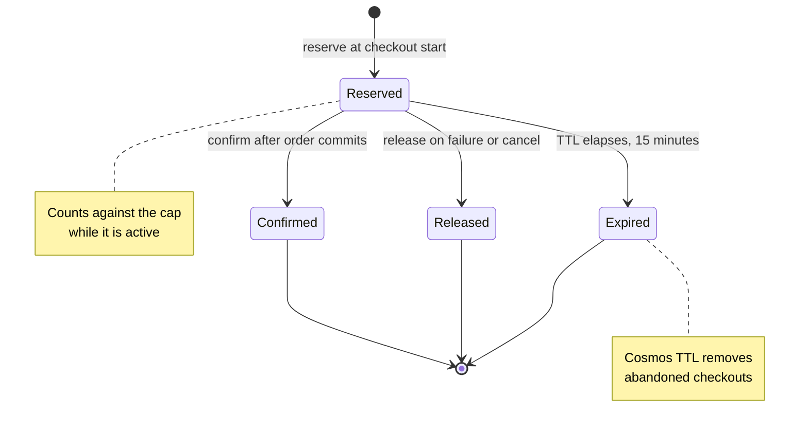


| Transition | Endpoint                               | Idempotency                                     | Failure                                         |
| ---------- | -------------------------------------- | ----------------------------------------------- | ----------------------------------------------- |
| Reserve    | `POST /reservations`                   | Same `orderId` returns the existing reservation | `409` when the cap is already consumed          |
| Confirm    | `POST /reservations/{orderId}/confirm` | Confirming twice is a no-op                     | `404` when unknown, `409` when already released |
| Release    | `POST /reservations/{orderId}/release` | Releasing twice is a no-op                      | `404` when unknown                              |
| Expire     | none, TTL                              | Automatic                                       | Reservation stops counting                      |


`orderId` is the idempotency key throughout, enforced by a unique key in Cosmos rather than by application checks. A retried network call cannot double-count.

---


## 10. Flows


### 10.1 Interactive preview — advisory

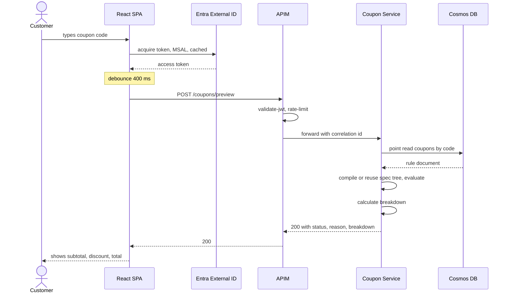


Preview **never** reserves, writes or consumes a use. It answers 200 even when the coupon is rejected, with a machine-readable reason, so the UI renders "this code expired on 30 August" instead of handling an error.

### 10.2 Authoritative checkout

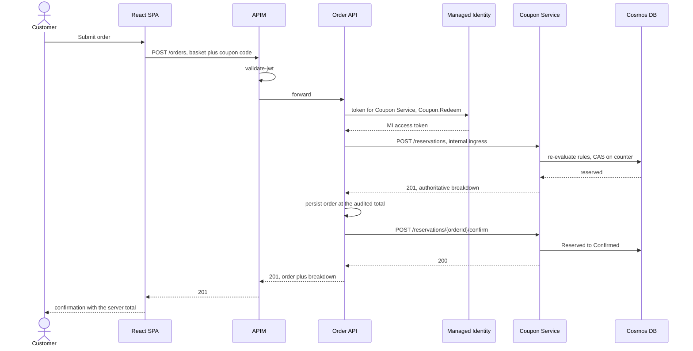


The price the browser showed is discarded. The Order API stores only the total the Coupon Service returned, which is what closes client-side tampering.

### 10.3 Checkout fails after reservation

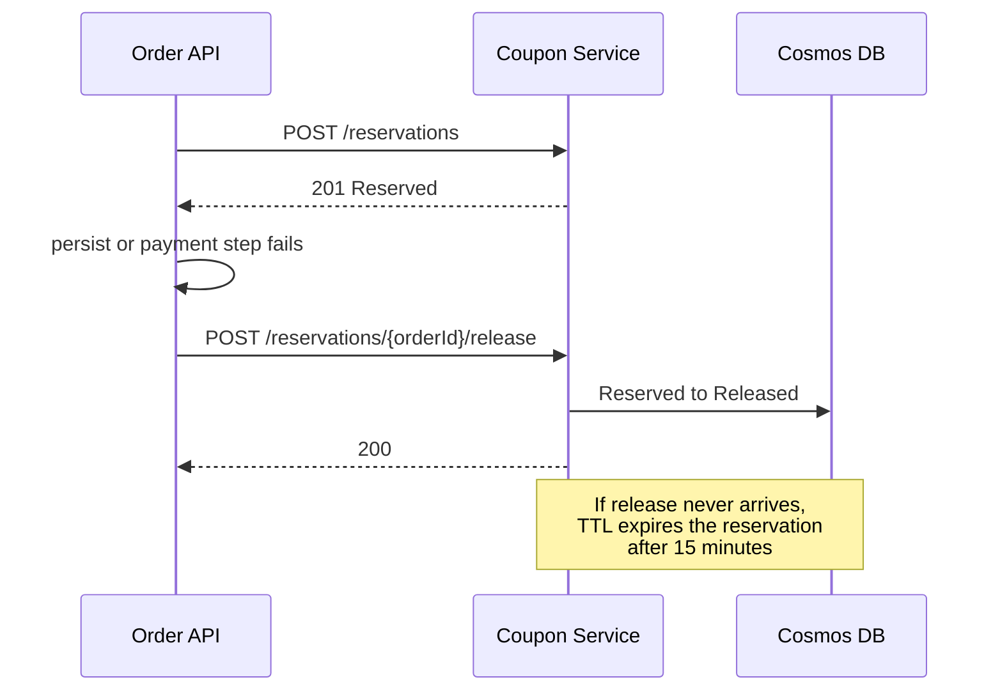


The TTL is the safety net for the case where the Order API dies between reserve and confirm. Without it, a crash permanently burns a use.

### 10.4 Admin campaign change

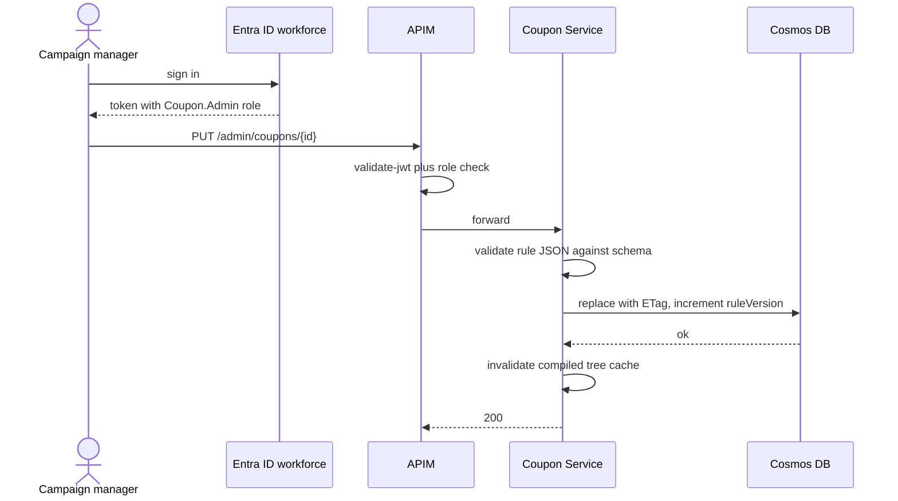


---


## 11. API surface


### 11.1 Coupon Service — customer facing, via APIM


| Method | Path               | Auth         | Purpose                                                       |
| ------ | ------------------ | ------------ | ------------------------------------------------------------- |
| `POST` | `/coupons/preview` | Customer JWT | Evaluate a code against a basket, return breakdown and status |
| `GET`  | `/health/live`     | Anonymous    | Liveness                                                      |
| `GET`  | `/health/ready`    | Anonymous    | Readiness, includes Cosmos reachability                       |


### 11.2 Coupon Service — backend only, not published publicly


| Method | Path                              | Auth                    | Purpose                                    |
| ------ | --------------------------------- | ----------------------- | ------------------------------------------ |
| `POST` | `/reservations`                   | MI plus `Coupon.Redeem` | Re-price authoritatively and reserve a use |
| `POST` | `/reservations/{orderId}/confirm` | MI plus `Coupon.Redeem` | Commit the redemption                      |
| `POST` | `/reservations/{orderId}/release` | MI plus `Coupon.Redeem` | Return the reserved use                    |


### 11.3 Coupon Service — admin, via APIM


| Method   | Path                  | Auth           | Purpose                                   |
| -------- | --------------------- | -------------- | ----------------------------------------- |
| `GET`    | `/admin/coupons`      | `Coupon.Admin` | List with paging and status filter        |
| `GET`    | `/admin/coupons/{id}` | `Coupon.Admin` | Read one with its rule tree               |
| `POST`   | `/admin/coupons`      | `Coupon.Admin` | Create, schema validated                  |
| `PUT`    | `/admin/coupons/{id}` | `Coupon.Admin` | Update, ETag required                     |
| `DELETE` | `/admin/coupons/{id}` | `Coupon.Admin` | Soft delete to `Disabled`, audit retained |


### 11.4 Order API — stand-in for the client platform


| Method | Path           | Auth         | Purpose                                |
| ------ | -------------- | ------------ | -------------------------------------- |
| `GET`  | `/pizzas`      | Customer JWT | Catalog, seeded from the repo snapshot |
| `POST` | `/orders`      | Customer JWT | Authoritative checkout                 |
| `GET`  | `/orders/{id}` | Customer JWT | Read back the audited total            |


### 11.5 Error contract

One rule: **a rejected coupon is a business outcome, not a transport error.**


| Situation                                         | Status | Body                                                  |
| ------------------------------------------------- | ------ | ----------------------------------------------------- |
| Preview, coupon applies                           | `200`  | `status: Applied` plus breakdown                      |
| Preview, coupon rejected                          | `200`  | `status: Rejected`, `reason`, breakdown at full price |
| Missing or invalid token                          | `401`  | problem detail                                        |
| Valid token, wrong role                           | `403`  | problem detail                                        |
| Malformed body, unknown pizza, quantity below one | `400`  | problem detail with field errors                      |
| Reserve when cap consumed                         | `409`  | problem detail, `reason: UsageLimitReached`           |
| Confirm or release unknown order                  | `404`  | problem detail                                        |
| Rule document corrupt or engine failure           | `500`  | problem detail, correlation id, alert raised          |


Rejection reasons are a closed enum: `NotFound`, `Expired`, `NotYetActive`, `MinimumOrderNotMet`, `CategoryNotEligible`, `UsageLimitReached`, `PerCustomerLimitReached`, `NotFirstOrder`, `DayNotEligible`, `Disabled`.

Errors use `application/problem+json` per RFC 7807 and always carry the correlation id.

**Checkout policy.** If a coupon previewed as valid but fails at checkout, the default is `AllowWithoutDiscount`: the order is placed at full price with the reason attached. A caller may send `couponPolicy: RequireDiscount` to get `409` instead. This resolves the ambiguity of "should a bad coupon fail the order" by making it the caller's explicit choice, with the safe default.

APIs are versioned by path prefix, `/v1`, with the version also present in the APIM product routing.

---


## 12. Data design

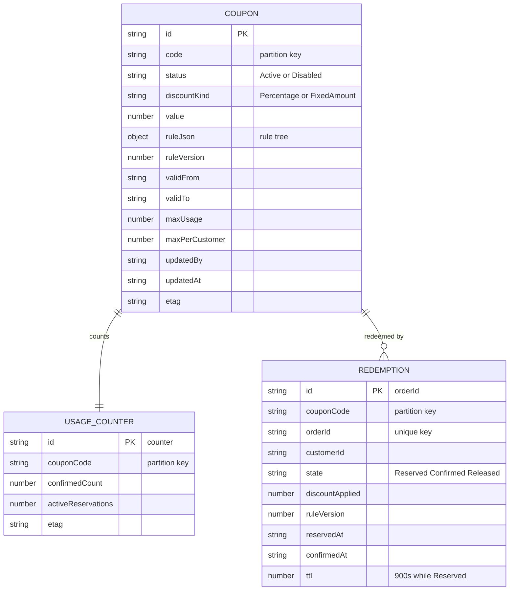


### 12.1 Why redemptions are partitioned by coupon code

This is the main correction to the reference proposal, which partitions redemptions by customer.

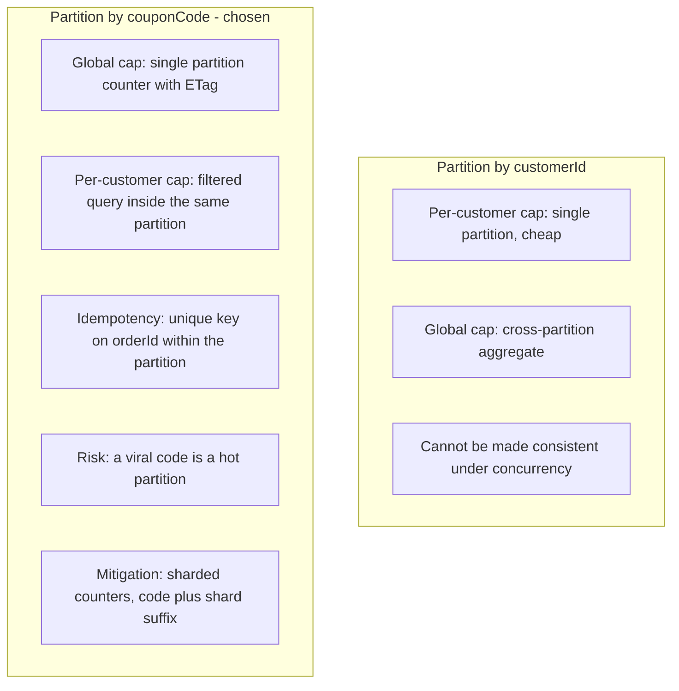


A global usage cap is the constraint that must be **transactionally** correct; a per-customer cap can tolerate a filtered read. Partitioning by coupon code puts the counter, the per-customer check and the idempotency key in one logical partition, so a single-partition transactional batch enforces all three. The accepted cost is write concentration on a popular code, which sharding solves if measurements ever demand it.

### 12.2 Reserve under concurrency

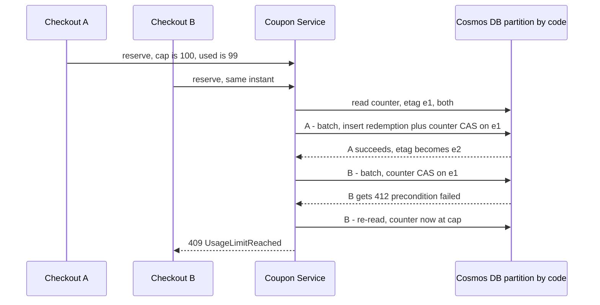


Retries use bounded exponential backoff with jitter, capped at three attempts, then surface `409`. The cap is never exceeded, and no distributed lock is required.

### 12.3 Seeding and retention

Deployment seeds a small deterministic campaign set so BDD and demos are repeatable: `SAVE10` percentage, `FLAT5` fixed amount with a minimum, `VEGGIE15` category plus composite, `OLDCODE` expired, `LIMITED1` cap of one.

`REDEMPTION` holds `customerId`, which is personal data. Retention is configurable with a default of ninety days for confirmed and released records; reserved records self-clean via TTL. The proposal states this rather than leaving a silent personal-data store.

---


## 13. Security and authentication

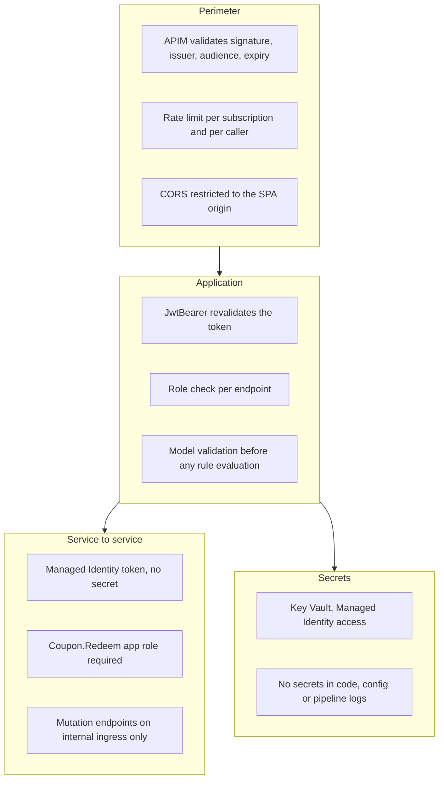


| Concern            | Mechanism                                                                               |
| ------------------ | --------------------------------------------------------------------------------------- |
| Customer identity  | Entra External ID, OAuth2 and OIDC, MSAL in the SPA, authorization code with PKCE       |
| Admin identity     | Workforce Entra ID, `Coupon.Admin` app role                                             |
| Service to service | Managed Identity, `Coupon.Redeem` app role, no shared secret to rotate                  |
| Gateway            | APIM `validate-jwt` against the tenant OpenID configuration                             |
| Defence in depth   | The service revalidates the token, so bypassing APIM does not bypass auth               |
| Secrets            | Key Vault with Managed Identity; the pipeline never echoes values                       |
| Transport          | HTTPS only, TLS 1.2 minimum                                                             |
| Tamper resistance  | Price and eligibility recomputed server side at checkout; the client number is advisory |


Threats explicitly considered: basket or total tampering from the browser, replaying a preview response, brute-forcing coupon codes (rate limiting plus generic `NotFound`), double-spending a capped coupon (CAS plus unique key), a browser calling mutation endpoints (not routed publicly, and the app role is unavailable to user tokens), and rule injection (typed nodes only, schema validated).

---


## 14. Scalability

The load profile is deliberately asymmetric, and the design leans into that. A customer typing in the coupon box generates one **preview** call per debounce window; that same customer generates exactly one **checkout**. Preview is the hot path, checkout is the rare path, and the two are engineered differently.

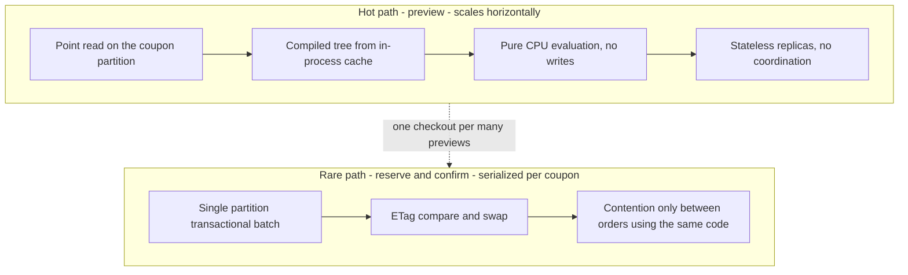

Preview does a single Cosmos **point read** on the coupon's own partition key, then pure CPU to evaluate the rule tree, with the compiled tree served from an in-process cache keyed on code plus `ruleVersion`. No writes, no locks, no cross-partition queries, nothing shared between replicas. Preview therefore scales by adding replicas, and the replicas need no coordination.

The write path is the only place with contention, and it is serialized **per coupon code**, not globally. Two customers redeeming different codes never touch the same partition. That is the payoff from the partitioning choice in section 12.1: correctness under concurrency costs one compare-and-swap inside one partition instead of a distributed lock or a cross-partition aggregate.

Worth stating what we consequently do **not** need: no cache tier, no queue, no lock service, no saga coordinator. Each of those appears the moment a design requires consistency across partitions, and the data model was chosen so that it never does.

### 14.1 Where it breaks first

Naming the order in which this design runs out of headroom is more useful than a throughput number we have not measured.

| Order | Limit | Symptom | Response |
|---|---|---|---|
| 1 | A single logical partition for one coupon | Throttling on a viral code | Sharded counters, `CODE#0` to `CODE#N`, summed on read |
| 2 | Scale-to-zero cold start | First call after idle is slow | `minReplicas: 1` and a paid APIM tier |
| 3 | Compiled-tree cache stampede after an admin edit | Brief CPU spike across replicas | Bounded, trees are small; measured rather than pre-optimised |
| 4 | Cosmos serverless throughput ceiling | Throttling under sustained load | Provisioned throughput with autoscale |

Limit 1 is the interesting one because it is a property of the data model rather than the SKU. The mitigation is documented in ADR-5 and the risk register but not built speculatively: sharding costs read complexity, and demo volume will never reach it.

### 14.2 The architecture scales, the demo SKUs deliberately do not

The tiers in section 18 were selected for near-zero cost, not for throughput. Moving to production capacity is a parameter change, not a redesign.

| Component | Demo | Production path |
|---|---|---|
| API Management | Consumption, scales to zero | Standard v2 with autoscale, no cold start |
| Services | Container Apps, minimum zero replicas | Minimum one or more, scale rules on concurrent requests |
| Cosmos DB | Serverless or free tier | Provisioned throughput with autoscale |
| Hot coupon | Single partition | Sharded counters |

None of those changes a line of domain code. That, rather than a requests-per-second figure, is the scalability claim we are making.

---

## 15. Performance

Ranked by CPU actually consumed, the coupon logic is not the expensive part of a request. This is worth stating plainly because it determines where optimisation effort belongs.

| Cost per preview request | Order of magnitude | Note |
|---|---|---|
| JWT signature verification | Tens of microseconds | Asymmetric crypto, per request, and APIM pays it too |
| JSON deserialise and serialise | Microseconds | Reflection is the avoidable part |
| Structured logging and enrichment | Microseconds | Allocation rather than computation |
| Rule tree evaluation | Sub-microsecond | Four to ten nodes over a cart of under ten lines |
| `decimal` arithmetic | Nanoseconds | Roughly an order of magnitude slower than binary floating point, and irrelevant at this size |

Latency ranks completely differently: the Cosmos point read at single-digit milliseconds dwarfs all of our CPU, and a cold start dwarfs the point read. So there are two separate problems — CPU-bound throughput and latency-bound user experience — and they take different fixes.

`decimal` was chosen knowing it is slower than `double`. Being wrong about money is not a performance trade worth making, and the cost disappears beneath the signature verification.

### 15.1 Optimisations that pay

**Do expensive setup once.** `CosmosClient` is a singleton because it owns connection pools; constructing one per request collapses throughput. The Managed Identity token for the internal hop is cached, since those tokens live for hours and fetching one per request would be ruinous. `JwtBearer` caches the signing keys, so validation stays local CPU with no network call. The compiled rule tree cache is the same principle applied to the domain.

**Order the rule tree cheapest-first, with I/O last.** This is the one place the domain design has a real performance lever. `ValidityWindow` is a date comparison, `ApplicableCategory` iterates cart lines, and `MaxUsageLimit` needs the counter document. Because `AndSpec` short-circuits, evaluating cheap leaves first means an expired coupon is rejected **without ever reading the counter** — saving a round trip, not just cycles.

**One round trip instead of two.** Reserve writes the redemption document and updates the counter in a single transactional batch: same partition, one round trip, one charge, atomic. Performance and correctness point the same way here.

**Attack cold start, since it is the visible cost.** ReadyToRun compilation cuts JIT work at startup, which scale-to-zero makes us pay repeatedly. Full native AOT is impractical with the Cosmos SDK's reflection, so ReadyToRun with trimming is the pragmatic setting.

**Source-generated JSON.** A `JsonSerializerContext` removes per-request reflection, cuts allocations on both the API surface and the Cosmos serialiser, and helps startup.

**Honour cancellation.** The SPA debounces and aborts in-flight requests as the customer keeps typing. Threading `CancellationToken` through to Cosmos means an abandoned preview stops consuming CPU and request units instead of completing into a response nobody reads.

**Cache only what is genuinely static.** The catalog is immutable between deployments, so it gets APIM response caching and an ETag, taking those calls to zero backend hits. Preview is deliberately not cached: it depends on cart, customer and live counter state.

**Bound the caches.** The compiled-tree cache has a size limit. Otherwise probing thousands of invalid codes grows it without limit, which is a memory problem and a code-enumeration vector simultaneously.

**No sync-over-async anywhere.** A single blocking wait in the request path starves the thread pool and turns a CPU-light service into a latency collapse under concurrency. This is worth more than every micro-optimisation above combined.

### 15.2 What we deliberately will not optimise

Hand-tuning allocations across a loop over five cart lines, or replacing `decimal` with scaled integers. Both are measurable in a benchmark and invisible in production, and the second trades away a correctness guarantee. The design's job is to avoid **algorithmic** mistakes — cross-partition queries, N+1 reads, per-request client construction, sync-over-async — not to shave nanoseconds off a tree walk.

### 15.3 How we measure rather than assert

- Application Insights already separates request duration from dependency duration, so Cosmos time versus our own compute is visible without extra instrumentation.
- Cosmos `RequestCharge` is logged as a structured field. Request units are the real currency of both Cosmos performance and Cosmos cost.
- The rule engine and price calculator are pure, deterministic and I/O-free, which makes them an ideal **BenchmarkDotNet** target. A small benchmark project gives a defensible per-evaluation figure instead of an assurance.
- A custom metric records evaluation duration and node count, so a pathological rule tree is visible in production.

On Container Apps consumption billing, vCPU-seconds are literally the invoice. Efficient code does not only make the service faster, it extends the monthly free grant, so performance work and cost control are the same activity here.

---

## 16. Resilience

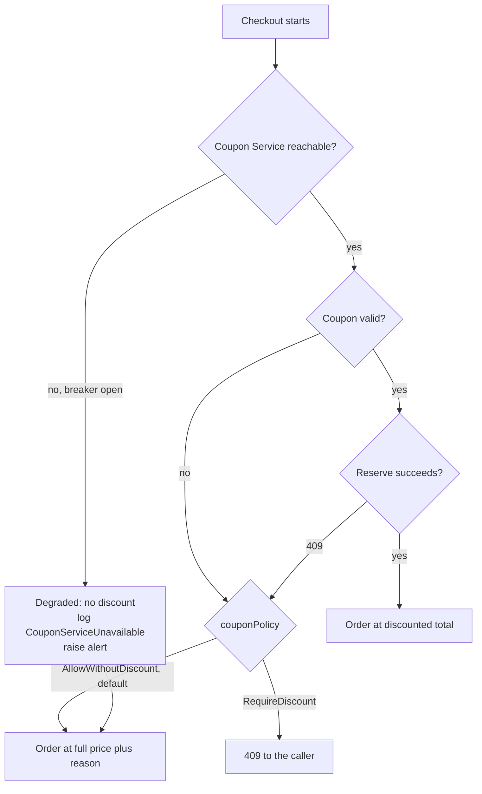


The rule is **fail closed on the discount, fail open on the order**. A coupon outage must not stop people buying pizza, and it must never hand out an unverified discount. Timeouts are short, three seconds on reserve, retries are bounded and only on idempotent operations, and the circuit breaker state is a logged, alertable event.

---


## 17. Observability

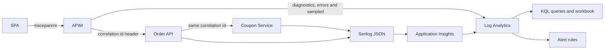


Every log line carries `CorrelationId`, `UserId`, `CouponCode`, `OrderId`, `RuleVersion`, `Outcome` and `DurationMs`. W3C `traceparent` propagates end to end, so one customer complaint resolves to one trace across gateway, order and coupon.

Domain events emitted as first-class telemetry: `CouponPreviewed`, `CouponApplied`, `CouponRejected`, `ReservationCreated`, `RedemptionConfirmed`, `ReservationReleased`, `ReservationExpired`, `UsageLimitReached`, `CouponServiceUnavailable`.

**Never logged:** bearer tokens, Cosmos keys, full rule documents at information level, customer address or contact details. `CouponCode` is logged because it is operationally essential and is not personal data.


| Alert               | Condition                                               |
| ------------------- | ------------------------------------------------------- |
| Rejection spike     | Rejection rate above fifty percent over fifteen minutes |
| Redemption failures | Any `500` on reserve, confirm or release                |
| Breaker open        | `CouponServiceUnavailable` observed                     |
| Latency             | Reserve p95 above one second                            |
| Readiness           | `/health/ready` failing                                 |
| Cost guard          | Log Analytics daily cap approached                      |


Stated SLO for the demo environment: 99 percent of preview calls under 800 ms and 99 percent of reserve calls under 1 second, measured at APIM, excluding cold starts, which are called out as a Consumption-tier characteristic rather than hidden.

---


## 18. Infrastructure

```mermaid
flowchart TB
    subgraph rg ["Resource group - one region"]
        APIM["APIM Consumption"]
        CAE["Container Apps environment"]
        CA1["Container App - Order API"]
        CA2["Container App - Coupon Service"]
        SWA["Static Web Apps - Free"]
        COS[("Cosmos DB - serverless or free tier")]
        KV["Key Vault"]
        AI["Application Insights"]
        LA["Log Analytics"]
        ACR["Container Registry"]
        MI["User assigned Managed Identity"]
    end

    APIM --> CA1
    APIM --> CA2
    CA1 --> CA2
    CA2 --> COS
    CA1 --> MI
    CA2 --> MI
    MI --> KV
    CA1 --> AI
    CA2 --> AI
    AI --> LA
    ACR --> CA1
    ACR --> CA2
    SWA --> APIM
```


### 18.1 Tiers and cost


| Resource                               | Tier                                                    | Cost posture                                                                                                                                               |
| -------------------------------------- | ------------------------------------------------------- | ---------------------------------------------------------------------------------------------------------------------------------------------------------- |
| API Management                         | **Consumption**                                         | First million calls per month included. Named explicitly, because the reference proposal leaves the tier open and Developer tier is a real monthly charge. |
| Container Apps                         | Consumption                                             | Monthly free grant of vCPU seconds, memory seconds and requests covers demo traffic. Scale to zero.                                                        |
| Static Web Apps                        | Free                                                    | Frontend hosting and CDN.                                                                                                                                  |
| Cosmos DB                              | Free tier if the subscription has none, else serverless | Free tier is one account per subscription and must be enabled at creation. Serverless is pay per request and negligible at demo volume.                    |
| Application Insights and Log Analytics | Pay as you go                                           | Small monthly ingest allowance, short retention, daily cap configured.                                                                                     |
| Key Vault                              | Standard                                                | Per-operation pricing, effectively nil.                                                                                                                    |
| Container Registry                     | **Basic — the only line item that is not free**         | Roughly five dollars a month. Alternatives: a public registry, or the App Service route below.                                                             |
| Entra External ID                      | Free monthly active user allowance                      | Confirm the current threshold at implementation time.                                                                                                      |


### 18.2 Hosting decision


|                        | Container Apps plus ACR                                           | App Service Free F1                                         |
| ---------------------- | ----------------------------------------------------------------- | ----------------------------------------------------------- |
| Cost                   | Free grant covers compute, registry is about five dollars a month | Genuinely zero                                              |
| Scale to zero          | Yes                                                               | Sleeps, does not scale                                      |
| Two services           | Natural, one environment                                          | Two apps on one plan, sharing a 60 CPU-minute daily quota   |
| Internal ingress       | Yes, native for the backend-only endpoints                        | Not available, public hostname with JWT as the only control |
| Revisions and rollback | Built in                                                          | Slots unavailable on Free                                   |


**Recommendation:** Container Apps, because internal ingress is what makes "mutation endpoints are not publicly reachable" true in infrastructure rather than only in policy. If the client requires strictly zero spend, we fall back to App Service F1 and document that the backend-only endpoints are then protected by the app role alone. This is a one-parameter switch in Bicep, and we will confirm the choice before provisioning.

### 18.3 Bicep layout

```text
infra/bicep/
  main.bicep                  # resource group scope, orchestrates modules
  main.demo.bicepparam        # demo parameters, no secrets
  modules/
    observability.bicep       # Log Analytics + Application Insights
    identity.bicep            # user assigned MI + role assignments
    keyvault.bicep
    cosmos.bicep              # account, database, containers, TTL, unique keys
    containerapps.bicep       # environment + both apps + internal ingress
    appservice.bicep          # fallback host, toggled by parameter
    apim.bicep                # service, products, named values
    apim-api.bicep            # OpenAPI import + policies
    staticwebapp.bicep
  policies/
    customer-product.xml      # validate-jwt, cors, rate-limit
    admin-product.xml         # validate-jwt + role claim check
```

Every deployment runs `what-if` before `create`. Parameters carry no secrets. Resources are tagged `project`, `env` and `owner` so cost can be filtered and the whole environment deleted in one command.

---


## 19. CI/CD

```mermaid
flowchart LR
    S1["1. Build<br/>restore, build, analyzers"]
    S2["2. Unit and service tests<br/>xUnit, FluentAssertions, coverage"]
    S3["3. Package<br/>container images, OpenAPI, SPA bundle"]
    S4["4. Provision<br/>Bicep what-if then create"]
    S5["5. Deploy<br/>images, SPA, APIM import and policies"]
    S6["6. Seed<br/>deterministic campaign data"]
    S7["7. BDD post-deploy<br/>Reqnroll through APIM"]
    S8["8. Verify and report<br/>smoke, test results, teardown option"]

    S1 --> S2 --> S3 --> S4 --> S5 --> S6 --> S7 --> S8
    S2 -.->|"fail"| X1["Pipeline fails, nothing deployed"]
    S7 -.->|"fail"| X2["Stage fails, environment flagged"]
```


| Stage                  | Gate                                                                   |
| ---------------------- | ---------------------------------------------------------------------- |
| Build                  | Warnings as errors on the domain projects                              |
| Unit and service tests | All green, coverage threshold on the rule engine and pricing           |
| Provision              | `what-if` output published as an artifact before any change is applied |
| Deploy                 | Readiness probe must pass before the next stage                        |
| Seed                   | Idempotent, safe to run on every deployment                            |
| BDD                    | Any scenario failure fails the stage                                   |


Authentication to Azure uses a workload-identity federated service connection, so there is no long-lived secret in the pipeline. Environments are modelled in Azure DevOps with an approval on anything beyond the demo environment. Rollback is a redeploy of the previous revision for the services and a re-run of the previous template for infrastructure.

One-time manual prerequisites, and nothing beyond these: create the Azure DevOps project, create the service connection, and grant the app registration permission. Everything after that is pipeline-driven, which is what the brief means by "no manual deployment or configuration steps".

---


## 20. Testing

```mermaid
flowchart TB
    subgraph ci ["CI, no infrastructure"]
        U1["Rule engine specs<br/>leaf, And, Or, compiler, cache"]
        U2["PriceCalculator<br/>rounding, caps, empty cart"]
        U3["CouponValidator<br/>fixed clock, all rejection reasons"]
        U4["Redeemer with fake repository<br/>idempotency, CAS conflict"]
        U5["API contract tests<br/>WebApplicationFactory, 400 and 401 and 403"]
    end
    subgraph post ["Post deploy, real stack"]
        B1["Reqnroll BDD through APIM"]
        B2["Auth negative paths"]
        B3["Reserve, confirm, release round trip"]
    end
    U1 --> U2 --> U3 --> U4 --> U5 --> B1 --> B2 --> B3
```


Two stages, matching the reference proposal's intent, with the isolation problem fixed.

### 20.1 Test data isolation

The reference proposal's post-deploy scenarios expect fixed codes such as `LIMITED10` to be in a specific usage state. Run the pipeline twice and those scenarios contradict each other. Our BDD run instead:

1. Generates a run-scoped prefix, for example `RUN7F3A_`.
2. Seeds exactly the campaigns the run needs through the admin API.
3. Executes scenarios against those codes only.
4. Deletes them in teardown.

The suite is therefore repeatable, parallel-safe, and does not depend on leftover state.

### 20.2 Representative scenarios

```gherkin
Feature: Coupon validation and order pricing

  Scenario: Percentage coupon reduces the total
    Given a cart with 2 x "Margherita" at 9.50 and 1 x "BBQ Chicken" at 12.00
    And an active coupon "SAVE10" giving 10 percent off
    When the customer previews the coupon
    Then the subtotal is 31.00
    And the discount is 3.10
    And the total is 27.90
    And the coupon status is "Applied"

  Scenario: Fixed amount never drives the total below zero
    Given a cart totalling 4.00
    And an active coupon "FLAT5" giving 5.00 off
    When the customer previews the coupon
    Then the discount is 4.00
    And the total is 0.00

  Scenario: Expired coupon is reported, not thrown
    Given a coupon "OLDCODE" whose validity window ended yesterday
    When the customer previews the coupon
    Then the response status is 200
    And the coupon status is "Rejected"
    And the rejection reason is "Expired"

  Scenario: Minimum order value not met
    Given a cart totalling 9.99
    And an active coupon "FLAT5" requiring a minimum of 20.00
    When the customer previews the coupon
    Then the rejection reason is "MinimumOrderNotMet"
    And the total equals the subtotal

  Scenario: Category restricted coupon rejects a non eligible cart
    Given a cart containing only "Pepperoni"
    And an active coupon "VEGGIE15" restricted to category "Vegetarian"
    When the customer previews the coupon
    Then the rejection reason is "CategoryNotEligible"

  Scenario: Composite AND with OR passes on the first order branch
    Given a vegetarian cart totalling 18.00
    And the customer has never ordered before
    When the customer previews the coupon "VEGGIE15"
    Then the coupon status is "Applied"
    And the discount percentage is 15

  Scenario: Usage limit is enforced across concurrent checkouts
    Given a coupon "LIMITED1" with a maximum usage of 1
    When two orders reserve "LIMITED1" at the same time
    Then exactly one reservation succeeds
    And the other is rejected with reason "UsageLimitReached"

  Scenario: Reservation is idempotent for the same order
    Given order "ORD-1" has reserved "SAVE10"
    When the Order API retries the reservation for "ORD-1"
    Then the same reservation is returned
    And the usage count has not increased

  Scenario: Released reservation returns the use to the pool
    Given order "ORD-2" reserved "LIMITED1"
    When the order fails and the reservation is released
    Then "LIMITED1" can be reserved again

  Scenario: Client side tampering is ignored
    Given a cart whose true total is 31.00
    When the client submits the order claiming a total of 1.00
    Then the stored order total is 27.90 with coupon "SAVE10"

  Scenario: Preview requires authentication
    Given an unauthenticated caller
    When the coupon preview endpoint is called
    Then the response status is 401

  Scenario: Mutation endpoints reject a customer token
    Given a valid customer token without the "Coupon.Redeem" role
    When the reservations endpoint is called
    Then the response status is 403
```

The last three scenarios are the ones that prove the architecture rather than the arithmetic: tampering is ineffective, concurrency is safe, and privilege separation holds.

---


## 21. Frontend

React 18 with TypeScript, Vite and Material UI, hosted on Static Web Apps.

```mermaid
flowchart LR
    CAT["Catalog view"] --> CART["Cart with quantities"]
    CART --> CODE["Coupon input"]
    CODE -->|"debounced 400 ms"| PREV["Preview call"]
    PREV --> DISP["Subtotal, discount, total<br/>and rejection reason"]
    DISP --> SUB["Submit order"]
    SUB --> CONF["Confirmation with the server total"]
```


The SPA holds **no** pricing rules. It renders numbers the service returned, treats every previewed price as a hint, and shows the confirmation total from the order response. Tokens are acquired with MSAL using authorization code with PKCE; no secret ships to the browser.

---


## 22. Repository layout

```text
src/
  CouponService.Api/            # controllers, middleware, DI, OpenAPI
  CouponService.Application/    # use cases, clean interfaces
  CouponService.Domain/         # cart, coupon, specs, price breakdown
  CouponService.Infrastructure/ # Cosmos repositories, Serilog, options
  OrderApi/                     # thin authoritative checkout stand-in
  web/                          # React TypeScript SPA
tests/
  CouponService.UnitTests/      # xUnit + FluentAssertions
  CouponService.ApiTests/       # WebApplicationFactory contract tests
  CouponService.Bdd/            # Reqnroll features and steps
infra/
  bicep/                        # delivery IaC
  terraform/                    # documented alternative, not wired to CI
data/
  pizzas.json                   # catalog snapshot
  coupons.seed.json             # deterministic campaigns
docs/
  solution-architecture.md
  deployment.md
  authentication.md
  assumptions.md
azure-pipelines.yml
```


### Infrastructure as code — a note on tooling

Bicep is the delivery choice for this assignment: it is native to Azure and Azure DevOps, needs no remote state store to create and secure, and satisfies "deploy from scratch" with a single deployment command. The author has production Terraform experience, and the same resource graph maps directly onto the `azurerm` provider; the `infra/terraform` folder documents that route without maintaining a second live stack. One tool per environment.

---


## 23. Architecture decisions


| ID     | Decision                                               | Rationale                                                                                                 | Rejected alternative                                                                 |
| ------ | ------------------------------------------------------ | --------------------------------------------------------------------------------------------------------- | ------------------------------------------------------------------------------------ |
| ADR-1  | Standalone Coupon Service                              | The brief introduces a coupon service; keeps the ordering platform untouched and independently deployable | Coupons inside the order service, which couples campaign changes to order releases   |
| ADR-2  | Preview advisory, checkout authoritative               | Removes client-side tampering while keeping the UI responsive                                             | Trusting the client total, or a single blocking synchronous validation               |
| ADR-3  | Composite Specification over JSON rules                | New campaigns are data; satisfies "clean interface for validation"                                        | Hard-coded rule branches, or a scripting expression engine with an injection surface |
| ADR-4  | Reserve, confirm, release                              | Enforces caps across systems without distributed locks                                                    | Decrement on preview, which leaks uses on abandoned carts                            |
| ADR-5  | Redemptions partitioned by coupon code                 | Puts the global counter, per-customer check and idempotency key in one partition                          | Partition by customer, which makes the global cap a cross-partition aggregate        |
| ADR-6  | ETag compare-and-swap on the counter                   | Correct under concurrency, no lock service                                                                | Read-then-write, which oversells capped coupons                                      |
| ADR-7  | Managed Identity with an app role for the internal hop | No secret to rotate, and mutation paths are unreachable from a browser                                    | Shared API key, or exposing mutations on the public product                          |
| ADR-8  | Entra External ID for customers                        | Consumer identity product; MSAL is the expected client                                                    | Workforce tenant for consumers, which is the wrong tenant type                       |
| ADR-9  | APIM Consumption                                       | Meets the APIM requirement inside a free call grant                                                       | Developer tier, a real monthly charge for a demo                                     |
| ADR-10 | Container Apps with an App Service fallback            | Internal ingress makes the private endpoints private in infrastructure, not just in policy                | App Service Free only, where every endpoint is publicly addressable                  |
| ADR-11 | Bicep for delivery                                     | Native, stateless, single deployment command                                                              | Terraform, which adds a state backend to provision and secure                        |
| ADR-12 | Rejections are 200 with a reason                       | A rejected coupon is a business outcome; gives one contract clients can code against                      | Mixed 400 and 404 per rejection type                                                 |
| ADR-13 | Fail closed on discount, fail open on order            | A coupon outage must not stop sales, and must not grant unverified discounts                              | Failing checkout, or applying the client's claimed discount                          |
| ADR-14 | Run-scoped BDD test data                               | Post-deploy suite is repeatable and parallel safe                                                         | Fixed shared codes whose state drifts between runs                                   |
| ADR-15 | `decimal` for all money                                | Correctness outweighs speed, and the cost is negligible beside signature verification                     | `double` or scaled integers, which trade away a correctness guarantee                |
| ADR-16 | Rule leaves evaluated cheapest-first, I/O last         | Short-circuiting a failed date check avoids a Cosmos read entirely, saving a round trip and not just CPU  | Fixed declaration order, which pays for I/O on rules that were already doomed        |


---


## 24. Risks


| Risk                                              | Impact                                                  | Mitigation                                                                                                        |
| ------------------------------------------------- | ------------------------------------------------------- | ----------------------------------------------------------------------------------------------------------------- |
| APIM Consumption and Container Apps cold starts   | First call after idle is slow, and smoke tests time out | Generous timeouts in post-deploy tests, cold start documented as a tier characteristic, readiness gate before BDD |
| Cosmos free tier already used in the subscription | Provisioning fails                                      | Parameter switches to serverless, which is negligible at demo volume                                              |
| Container Registry is not free                    | Small monthly charge                                    | Public registry or the App Service fallback; flagged before provisioning                                          |
| Subscription has a spending limit                 | APIM or Cosmos cannot be created                        | Confirm the offer before the first run; the pipeline fails fast with a clear message                              |
| Entra External ID tenant not available            | Customer sign-in cannot be demonstrated                 | Fall back to workforce tenant tokens for the demo and document the difference                                     |
| No real Order platform to integrate with          | The double-validation flow has no upstream              | Thin Order API stand-in with an identical Coupon Service contract                                                 |
| Hot partition on a viral coupon                   | Write throttling                                        | Sharded counters, documented and measurable                                                                       |
| Scope larger than the timebox                     | Frontend or admin slips                                 | Delivery waves below; the backend, pipeline and BDD land before the SPA                                           |


---


## 25. Delivery waves

```mermaid
flowchart LR
    W1["Wave 1<br/>Domain, rule engine,<br/>pricing, unit tests"]
    W2["Wave 2<br/>Cosmos model, redemption<br/>lifecycle, admin API"]
    W3["Wave 3<br/>Auth, APIM, Order API,<br/>contract tests"]
    W4["Wave 4<br/>Bicep, pipeline,<br/>seed, post-deploy BDD"]
    W5["Wave 5<br/>React SPA"]
    W6["Wave 6<br/>Docs, alerts,<br/>walkthrough"]

    W1 --> W2 --> W3 --> W4 --> W5 --> W6
    W1 -.->|"parallel"| W4
```


Waves 1 and 2 need no Azure access, so work starts immediately and the environment is only required from wave 3 onward.

---


## 26. Assumptions

1. No existing pizza ordering codebase or environment is provided; we build the thin Order API as the authoritative caller.
2. The pizza catalog is a one-time snapshot of a public mock menu, committed to the repository as `data/pizzas.json`; nothing is fetched from that mock at runtime.
3. One coupon per order. Stacking, loyalty and gift cards are out of scope.
4. No payment provider. The confirm step stands in for "payment captured".
5. Single currency, `EUR` by default, configurable.
6. No tax line unless a rate is specified.
7. Rejected coupons default to `AllowWithoutDiscount` at checkout.
8. Campaigns are seeded at deployment and managed through the admin API; no admin UI.
9. Azure DevOps project, an enabled Azure subscription and permission to create app registrations are provided before wave 3.
10. Demo environment only. No production hardening, HA or DR commitments.
